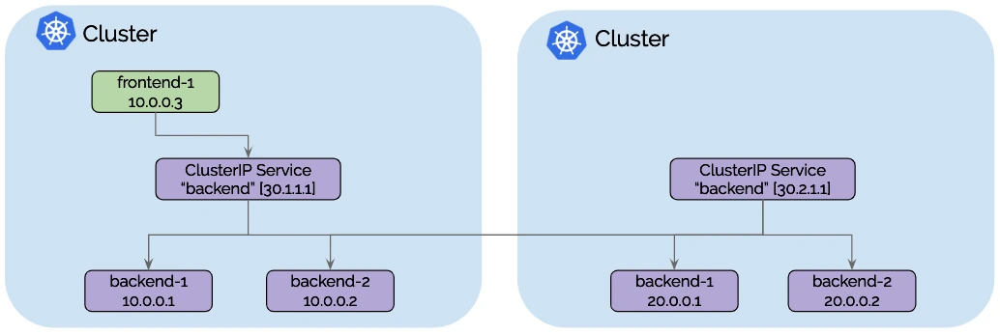
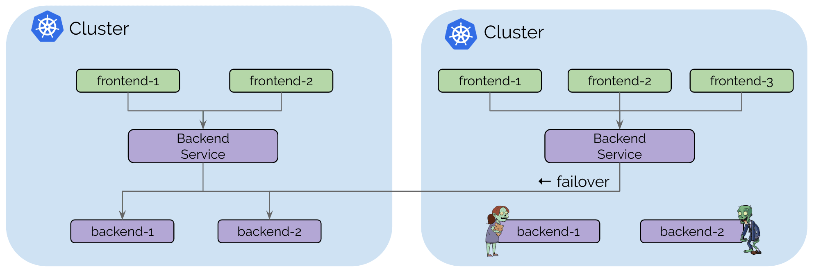

# Cilium MultiCluster

kubernetes CNI Plugin cilium, cilium 을 활용한 multiClustering 


# 1. 개요

Cilium Cluster Mesh를 통해 멀티 클러스터를 원할하게 연결할 수 있다.


* 클러스터별 Cilium을 CNI로 실행
* 각 클러스터의 포드가 메시의 다른 모든 클러스터에 있는 서비스를 검색하고 액세스할 수 있는 있음
* 여러 클러스터를 대규모 통합 네트워크에 효과적으로 결합할 수 있음


## Cluster별 HA 구성

* 클러스터간 동일한 Namespace 를 가진 서비스를 글로벌 서비스로 자동  병합 함





* 클러스터내 서비스별로 작동 여부를 동적으로 설정 가능
  * 업그레이드를 위해 일시적으로 오프라인을 유지해야 하는 경우 
  * 리소스를 부족과 같은 일부 서비스의 장애와 같은 경우
  * 각 클러스터내 서비스의 접근을 동적으로 조정할 수 있다. 





# 2. cilium


## 1) cilium cli install


```sh
$ mkdir -p ~/song/cilium
  cd ~/song/cilium

$ CILIUM_CLI_VERSION=$(curl -s https://raw.githubusercontent.com/cilium/cilium-cli/main/stable.txt)
# v0.15.8 - 2023.09.17 시점


$ CLI_ARCH=amd64

$ if [ "$(uname -m)" = "aarch64" ]; then CLI_ARCH=arm64; fi

$ curl -L --fail --remote-name-all https://github.com/cilium/cilium-cli/releases/download/${CILIUM_CLI_VERSION}/cilium-linux-${CLI_ARCH}.tar.gz{,.sha256sum}

$ sha256sum --check cilium-linux-${CLI_ARCH}.tar.gz.sha256sum

$ sudo tar xzvfC cilium-linux-${CLI_ARCH}.tar.gz /usr/local/bin

$ rm cilium-linux-${CLI_ARCH}.tar.gz{,.sha256sum}


$ cilium version --client
cilium-cli: v0.15.8 compiled with go1.21.0 on linux/amd64
cilium image (default): v1.14.1
cilium image (stable): v1.14.1


```


## 2) multi cluster context setting


### (1) Kube Config Muti Cluster Set

참고링크 : https://kubernetes.io/docs/tasks/access-application-cluster/configure-access-multiple-clusters/

#### multi context file 설정

```yaml
# bastion02
$ cat ~/.kube/config
...
clusters:
- cluster:
    certificate-authority-data: LS0tLS1CRUdJTiBDRVJUSUZJQ0FURS0tLS0tCk1JSUJlRENDQVIyZ0F3SUJBZ0lCQURBS0JnZ3Foa2pPUFFRREFqQWpNU0V3SHdZRFZRUUREQmhyTTNNdGMyVnkKZG1WeUxXTmhRREUyT1RRM05qQXhOVEV3SGhjTk1qTXdPVEUxTURZME1qTXhXaGNOTXpNd09URXlNRFkwTWpNeApXakFqTVNFd0h3WURWUVFEREJock0zTXRjMlZ5ZG1WeUxXTmhRREUyT1RRM05qQXhOVEV3V1RBVEJnY3Foa2pPClBRSUJCZ2dxaGtqT1BRTUJCd05DQUFSY2VzRDRWOHJyZHBWOHRucWo5L2h5UUxBU05PT1JjSDUrdTZmaHpBNVoKMkRQWFZKQ0s5TjJBYUx1NklNRmJWWlFUSGVyai8wZGk0cStMTzhPN01uMEJvMEl3UURBT0JnTlZIUThCQWY4RQpCQU1DQXFRd0R3WURWUjBUQVFIL0JBVXdBd0VCL3pBZEJnTlZIUTRFRmdRVXlHYmxHUXBlVkJGMUFuS2ZHcDIwCkNwYVl6ZHN3Q2dZSUtvWkl6ajBFQXdJRFNRQXdSZ0loQUoya3lPdVF1TTUvY2Q4NVlwNGhXenRYd3BNdTlQM0EKSGpjWFNwN0Z2cE9vQWlFQStaTm0xdEdEVzRiTXgxdkRqQzVIZ3liVklIRnV2MmFwcjFERm5qeGFZN009Ci0tLS0tRU5EIENFUlRJRklDQVRFLS0tLS0K
    server: https://172.30.1.89:6443
  name: bastion02
users:
- name: bastion02
  user:
    client-certificate-data: LS0tLS1CRUdJTiBDRVJUSUZJQ0FURS0tLS0tCk1JSUJrRENDQVRlZ0F3SUJBZ0lJVElTZkFKUE1YbXN3Q2dZSUtvWkl6ajBFQXdJd0l6RWhNQjhHQTFVRUF3d1kKYXpOekxXTnNhV1Z1ZEMxallVQXhOamswTnpZd01UVXhNQjRYRFRJek1Ea3hOVEEyTkRJek1Wb1hEVEkwTURreApOREEyTkRJek1Wb3dNREVYTUJVR0ExVUVDaE1PYzNsemRHVnRPbTFoYzNSbGNuTXhGVEFUQmdOVkJBTVRESE41CmMzUmxiVHBoWkcxcGJqQlpNQk1HQnlxR1NNNDlBZ0VHQ0NxR1NNNDlBd0VIQTBJQUJCckJaUFh6TVBONlIvZTkKNTFPekV6UGx6elhzQUx0aE50SnlFdDd3YWdlWnYxSGszMWpQRVMzSWMyaUJYZHM4MWx3bW93L2srelBoditwagpwMlpvc2l5alNEQkdNQTRHQTFVZER3RUIvd1FFQXdJRm9EQVRCZ05WSFNVRUREQUtCZ2dyQmdFRkJRY0RBakFmCkJnTlZIU01FR0RBV2dCUytKWk05RS9sd2xGOXVraTkxWjhXZ2szV2pqREFLQmdncWhrak9QUVFEQWdOSEFEQkUKQWlBbE02cTVMQ0pyUDdtUmlqUUFtc1hTamQraUdjRjQxRlpmaHRJaHc4bnZ0Z0lnTUFNV3FEdkM4NjlUTmcrYgo3cEZydDNrRDdpREJoT2gzVXpReUY2T0tNRms9Ci0tLS0tRU5EIENFUlRJRklDQVRFLS0tLS0KLS0tLS1CRUdJTiBDRVJUSUZJQ0FURS0tLS0tCk1JSUJkekNDQVIyZ0F3SUJBZ0lCQURBS0JnZ3Foa2pPUFFRREFqQWpNU0V3SHdZRFZRUUREQmhyTTNNdFkyeHAKWlc1MExXTmhRREUyT1RRM05qQXhOVEV3SGhjTk1qTXdPVEUxTURZME1qTXhXaGNOTXpNd09URXlNRFkwTWpNeApXakFqTVNFd0h3WURWUVFEREJock0zTXRZMnhwWlc1MExXTmhRREUyT1RRM05qQXhOVEV3V1RBVEJnY3Foa2pPClBRSUJCZ2dxaGtqT1BRTUJCd05DQUFUUlpZbVU3bDcxb29UTXRVa2NKV0lhdkI5OGlvUC9Jc2JDOC96RUowcEIKRzErbjQvTy9yaW9NV2dZcFRqOVBTcWlVdXJFQ25YbngyTk93UVN5TGJhK1pvMEl3UURBT0JnTlZIUThCQWY4RQpCQU1DQXFRd0R3WURWUjBUQVFIL0JBVXdBd0VCL3pBZEJnTlZIUTRFRmdRVXZpV1RQUlA1Y0pSZmJwSXZkV2ZGCm9KTjFvNHd3Q2dZSUtvWkl6ajBFQXdJRFNBQXdSUUlnTjEyNUdBc3Jnc0RtWndPT2pXdStKTEhFVEtXaFJqMGkKTEdReEpSMzZpZklDSVFDS0dYSEcwWE9uSVNSRFk4WE4xY05XNVdSbWthRkRib2NxdXpPb1BxNlZCUT09Ci0tLS0tRU5EIENFUlRJRklDQVRFLS0tLS0K
    client-key-data: LS0tLS1CRUdJTiBFQyBQUklWQVRFIEtFWS0tLS0tCk1IY0NBUUVFSUtkbGFMaWQ2OXlPU0dRaS93WktSNGpuYTk2UVdsMFVBb0lpQS9RcWUxNkFvQW9HQ0NxR1NNNDkKQXdFSG9VUURRZ0FFR3NGazlmTXc4M3BIOTczblU3TVRNK1hQTmV3QXUyRTIwbklTM3ZCcUI1bS9VZVRmV004UgpMY2h6YUlGZDJ6eldYQ2FqRCtUN00rRy82bU9uWm1peUxBPT0KLS0tLS1FTkQgRUMgUFJJVkFURSBLRVktLS0tLQo=
...


# bastion03
$ cat ~/.kube/config
...
clusters:
- cluster:
    certificate-authority-data: LS0tLS1CRUdJTiBDRVJUSUZJQ0FURS0tLS0tCk1JSUJlRENDQVIyZ0F3SUJBZ0lCQURBS0JnZ3Foa2pPUFFRREFqQWpNU0V3SHdZRFZRUUREQmhyTTNNdGMyVnkKZG1WeUxXTmhRREUyT1RRM05qSTJNRGd3SGhjTk1qTXdPVEUxTURjeU16STRXaGNOTXpNd09URXlNRGN5TXpJNApXakFqTVNFd0h3WURWUVFEREJock0zTXRjMlZ5ZG1WeUxXTmhRREUyT1RRM05qSTJNRGd3V1RBVEJnY3Foa2pPClBRSUJCZ2dxaGtqT1BRTUJCd05DQUFUSlE1TUU2cjdrTk1kNXhFU1A0cmN0bWFLTWRKa1pvZzVwck05TTdNN1QKdlFmS0JRTEVXVHA0N01BV1NDMFVGYVlvSlBtT3dQa2FoUlloeXRDNXB5aHFvMEl3UURBT0JnTlZIUThCQWY4RQpCQU1DQXFRd0R3WURWUjBUQVFIL0JBVXdBd0VCL3pBZEJnTlZIUTRFRmdRVXhDeEYraXgraDd6ZkhmUDZzeVFrClY0UmJQdjh3Q2dZSUtvWkl6ajBFQXdJRFNRQXdSZ0loQUpENnBqU1ZUbmNxZnB4VFV3VnJpNXEyMTZjc044Y2MKNmVkcTM0Q2Yva25DQWlFQSsxUGpxbHJrd3BZNUhFTTgzaW5jRXdOei9aRm1VanZKY2t1QlVjeTJ5QW89Ci0tLS0tRU5EIENFUlRJRklDQVRFLS0tLS0K
    server: https://172.30.1.85:6443
  name: bastion03
users:
- name: bastion03
  user:
    client-certificate-data: LS0tLS1CRUdJTiBDRVJUSUZJQ0FURS0tLS0tCk1JSUJrRENDQVRlZ0F3SUJBZ0lJTjQ3Y1IyWDIrSEV3Q2dZSUtvWkl6ajBFQXdJd0l6RWhNQjhHQTFVRUF3d1kKYXpOekxXTnNhV1Z1ZEMxallVQXhOamswTnpZeU5qQTRNQjRYRFRJek1Ea3hOVEEzTWpNeU9Gb1hEVEkwTURreApOREEzTWpNeU9Gb3dNREVYTUJVR0ExVUVDaE1PYzNsemRHVnRPbTFoYzNSbGNuTXhGVEFUQmdOVkJBTVRESE41CmMzUmxiVHBoWkcxcGJqQlpNQk1HQnlxR1NNNDlBZ0VHQ0NxR1NNNDlBd0VIQTBJQUJMeXV5VmQrS2NHTzllU0YKUFcrK2N4R3d4VUkvZHF2TTlyYmcwVHVqUmdUUndQSTBBOWdHZUdhaFB4V2U0QTZXVGg3cERLWXVkRWp5MTVvKwpGMWFXMjllalNEQkdNQTRHQTFVZER3RUIvd1FFQXdJRm9EQVRCZ05WSFNVRUREQUtCZ2dyQmdFRkJRY0RBakFmCkJnTlZIU01FR0RBV2dCUm9ubjYyblJmK2dDM1dUcDJmZ29hM0JlNlIxekFLQmdncWhrak9QUVFEQWdOSEFEQkUKQWlBOXdDaERZWDU1cENVNERBdE8ydXdiQ09zUjVrMGlEb1E5VmVubUkrYkdJUUlnVDh5UlhMMk1RNUdOWDdMMAptYjVGTENvZU92NnVNQ2lqY1FadWs1WW1jZE09Ci0tLS0tRU5EIENFUlRJRklDQVRFLS0tLS0KLS0tLS1CRUdJTiBDRVJUSUZJQ0FURS0tLS0tCk1JSUJkakNDQVIyZ0F3SUJBZ0lCQURBS0JnZ3Foa2pPUFFRREFqQWpNU0V3SHdZRFZRUUREQmhyTTNNdFkyeHAKWlc1MExXTmhRREUyT1RRM05qSTJNRGd3SGhjTk1qTXdPVEUxTURjeU16STRXaGNOTXpNd09URXlNRGN5TXpJNApXakFqTVNFd0h3WURWUVFEREJock0zTXRZMnhwWlc1MExXTmhRREUyT1RRM05qSTJNRGd3V1RBVEJnY3Foa2pPClBRSUJCZ2dxaGtqT1BRTUJCd05DQUFSRGlib2VRNGk0VUlhS0l3aEEraFd5VVJzMnRscEgvaHFmK3NkcVNzd2gKaEIzSzR2Y2sveWtpcFFkWExKck1CclV4ZVdhQUV4R1dkcHhXMHNVcDRRZ2VvMEl3UURBT0JnTlZIUThCQWY4RQpCQU1DQXFRd0R3WURWUjBUQVFIL0JBVXdBd0VCL3pBZEJnTlZIUTRFRmdRVWFKNSt0cDBYL29BdDFrNmRuNEtHCnR3WHVrZGN3Q2dZSUtvWkl6ajBFQXdJRFJ3QXdSQUlnTmtxak9Dck0wUkdaWGhDdEIrY215bWhxVDhHdTJNb2oKSThZRGVGdU1xSFVDSUd4YTlYS2ZhMVE0QUI4TU1LQVRRSDlZSWlacDdCWlg5WlJSN3hjMXlsQWMKLS0tLS1FTkQgQ0VSVElGSUNBVEUtLS0tLQo=
    client-key-data: LS0tLS1CRUdJTiBFQyBQUklWQVRFIEtFWS0tLS0tCk1IY0NBUUVFSUJPZEVWMEZ4RCtHQmlqWGo2ZVhscmdLVnJqZ1FKZG80bW01dUZxZjFNTkVvQW9HQ0NxR1NNNDkKQXdFSG9VUURRZ0FFdks3SlYzNHB3WTcxNUlVOWI3NXpFYkRGUWo5MnE4ejJ0dURSTzZOR0JOSEE4alFEMkFaNApacUUvRlo3Z0RwWk9IdWtNcGk1MFNQTFhtajRYVnBiYjF3PT0KLS0tLS1FTkQgRUMgUFJJVkFURSBLRVktLS0tLQo=

...


# bastion02 에 만들어 준다. 
$ cat > ~/.kube/config-multi
---
apiVersion: v1
clusters:
- cluster:
    certificate-authority-data: LS0tLS1CRUdJTiBDRVJUSUZJQ0FURS0tLS0tCk1JSUJlRENDQVIyZ0F3SUJBZ0lCQURBS0JnZ3Foa2pPUFFRREFqQWpNU0V3SHdZRFZRUUREQmhyTTNNdGMyVnkKZG1WeUxXTmhRREUyT1RRM05qQXhOVEV3SGhjTk1qTXdPVEUxTURZME1qTXhXaGNOTXpNd09URXlNRFkwTWpNeApXakFqTVNFd0h3WURWUVFEREJock0zTXRjMlZ5ZG1WeUxXTmhRREUyT1RRM05qQXhOVEV3V1RBVEJnY3Foa2pPClBRSUJCZ2dxaGtqT1BRTUJCd05DQUFSY2VzRDRWOHJyZHBWOHRucWo5L2h5UUxBU05PT1JjSDUrdTZmaHpBNVoKMkRQWFZKQ0s5TjJBYUx1NklNRmJWWlFUSGVyai8wZGk0cStMTzhPN01uMEJvMEl3UURBT0JnTlZIUThCQWY4RQpCQU1DQXFRd0R3WURWUjBUQVFIL0JBVXdBd0VCL3pBZEJnTlZIUTRFRmdRVXlHYmxHUXBlVkJGMUFuS2ZHcDIwCkNwYVl6ZHN3Q2dZSUtvWkl6ajBFQXdJRFNRQXdSZ0loQUoya3lPdVF1TTUvY2Q4NVlwNGhXenRYd3BNdTlQM0EKSGpjWFNwN0Z2cE9vQWlFQStaTm0xdEdEVzRiTXgxdkRqQzVIZ3liVklIRnV2MmFwcjFERm5qeGFZN009Ci0tLS0tRU5EIENFUlRJRklDQVRFLS0tLS0K
    server: https://172.30.1.89:6443
  name: bastion02
- cluster:
    certificate-authority-data: LS0tLS1CRUdJTiBDRVJUSUZJQ0FURS0tLS0tCk1JSUJlRENDQVIyZ0F3SUJBZ0lCQURBS0JnZ3Foa2pPUFFRREFqQWpNU0V3SHdZRFZRUUREQmhyTTNNdGMyVnkKZG1WeUxXTmhRREUyT1RRM05qSTJNRGd3SGhjTk1qTXdPVEUxTURjeU16STRXaGNOTXpNd09URXlNRGN5TXpJNApXakFqTVNFd0h3WURWUVFEREJock0zTXRjMlZ5ZG1WeUxXTmhRREUyT1RRM05qSTJNRGd3V1RBVEJnY3Foa2pPClBRSUJCZ2dxaGtqT1BRTUJCd05DQUFUSlE1TUU2cjdrTk1kNXhFU1A0cmN0bWFLTWRKa1pvZzVwck05TTdNN1QKdlFmS0JRTEVXVHA0N01BV1NDMFVGYVlvSlBtT3dQa2FoUlloeXRDNXB5aHFvMEl3UURBT0JnTlZIUThCQWY4RQpCQU1DQXFRd0R3WURWUjBUQVFIL0JBVXdBd0VCL3pBZEJnTlZIUTRFRmdRVXhDeEYraXgraDd6ZkhmUDZzeVFrClY0UmJQdjh3Q2dZSUtvWkl6ajBFQXdJRFNRQXdSZ0loQUpENnBqU1ZUbmNxZnB4VFV3VnJpNXEyMTZjc044Y2MKNmVkcTM0Q2Yva25DQWlFQSsxUGpxbHJrd3BZNUhFTTgzaW5jRXdOei9aRm1VanZKY2t1QlVjeTJ5QW89Ci0tLS0tRU5EIENFUlRJRklDQVRFLS0tLS0K
    server: https://172.30.1.85:6443
  name: bastion03
contexts:
- context:
    cluster: bastion02
    user: bastion02
  name: bastion02
- context:
    cluster: bastion03
    user: bastion03
  name: bastion03
current-context: bastion02
kind: Config
preferences: {}
users:
- name: bastion02
  user:
    client-certificate-data: LS0tLS1CRUdJTiBDRVJUSUZJQ0FURS0tLS0tCk1JSUJrRENDQVRlZ0F3SUJBZ0lJVElTZkFKUE1YbXN3Q2dZSUtvWkl6ajBFQXdJd0l6RWhNQjhHQTFVRUF3d1kKYXpOekxXTnNhV1Z1ZEMxallVQXhOamswTnpZd01UVXhNQjRYRFRJek1Ea3hOVEEyTkRJek1Wb1hEVEkwTURreApOREEyTkRJek1Wb3dNREVYTUJVR0ExVUVDaE1PYzNsemRHVnRPbTFoYzNSbGNuTXhGVEFUQmdOVkJBTVRESE41CmMzUmxiVHBoWkcxcGJqQlpNQk1HQnlxR1NNNDlBZ0VHQ0NxR1NNNDlBd0VIQTBJQUJCckJaUFh6TVBONlIvZTkKNTFPekV6UGx6elhzQUx0aE50SnlFdDd3YWdlWnYxSGszMWpQRVMzSWMyaUJYZHM4MWx3bW93L2srelBoditwagpwMlpvc2l5alNEQkdNQTRHQTFVZER3RUIvd1FFQXdJRm9EQVRCZ05WSFNVRUREQUtCZ2dyQmdFRkJRY0RBakFmCkJnTlZIU01FR0RBV2dCUytKWk05RS9sd2xGOXVraTkxWjhXZ2szV2pqREFLQmdncWhrak9QUVFEQWdOSEFEQkUKQWlBbE02cTVMQ0pyUDdtUmlqUUFtc1hTamQraUdjRjQxRlpmaHRJaHc4bnZ0Z0lnTUFNV3FEdkM4NjlUTmcrYgo3cEZydDNrRDdpREJoT2gzVXpReUY2T0tNRms9Ci0tLS0tRU5EIENFUlRJRklDQVRFLS0tLS0KLS0tLS1CRUdJTiBDRVJUSUZJQ0FURS0tLS0tCk1JSUJkekNDQVIyZ0F3SUJBZ0lCQURBS0JnZ3Foa2pPUFFRREFqQWpNU0V3SHdZRFZRUUREQmhyTTNNdFkyeHAKWlc1MExXTmhRREUyT1RRM05qQXhOVEV3SGhjTk1qTXdPVEUxTURZME1qTXhXaGNOTXpNd09URXlNRFkwTWpNeApXakFqTVNFd0h3WURWUVFEREJock0zTXRZMnhwWlc1MExXTmhRREUyT1RRM05qQXhOVEV3V1RBVEJnY3Foa2pPClBRSUJCZ2dxaGtqT1BRTUJCd05DQUFUUlpZbVU3bDcxb29UTXRVa2NKV0lhdkI5OGlvUC9Jc2JDOC96RUowcEIKRzErbjQvTy9yaW9NV2dZcFRqOVBTcWlVdXJFQ25YbngyTk93UVN5TGJhK1pvMEl3UURBT0JnTlZIUThCQWY4RQpCQU1DQXFRd0R3WURWUjBUQVFIL0JBVXdBd0VCL3pBZEJnTlZIUTRFRmdRVXZpV1RQUlA1Y0pSZmJwSXZkV2ZGCm9KTjFvNHd3Q2dZSUtvWkl6ajBFQXdJRFNBQXdSUUlnTjEyNUdBc3Jnc0RtWndPT2pXdStKTEhFVEtXaFJqMGkKTEdReEpSMzZpZklDSVFDS0dYSEcwWE9uSVNSRFk4WE4xY05XNVdSbWthRkRib2NxdXpPb1BxNlZCUT09Ci0tLS0tRU5EIENFUlRJRklDQVRFLS0tLS0K
    client-key-data: LS0tLS1CRUdJTiBFQyBQUklWQVRFIEtFWS0tLS0tCk1IY0NBUUVFSUtkbGFMaWQ2OXlPU0dRaS93WktSNGpuYTk2UVdsMFVBb0lpQS9RcWUxNkFvQW9HQ0NxR1NNNDkKQXdFSG9VUURRZ0FFR3NGazlmTXc4M3BIOTczblU3TVRNK1hQTmV3QXUyRTIwbklTM3ZCcUI1bS9VZVRmV004UgpMY2h6YUlGZDJ6eldYQ2FqRCtUN00rRy82bU9uWm1peUxBPT0KLS0tLS1FTkQgRUMgUFJJVkFURSBLRVktLS0tLQo=
- name: bastion03
  user:
    client-certificate-data: LS0tLS1CRUdJTiBDRVJUSUZJQ0FURS0tLS0tCk1JSUJrRENDQVRlZ0F3SUJBZ0lJTjQ3Y1IyWDIrSEV3Q2dZSUtvWkl6ajBFQXdJd0l6RWhNQjhHQTFVRUF3d1kKYXpOekxXTnNhV1Z1ZEMxallVQXhOamswTnpZeU5qQTRNQjRYRFRJek1Ea3hOVEEzTWpNeU9Gb1hEVEkwTURreApOREEzTWpNeU9Gb3dNREVYTUJVR0ExVUVDaE1PYzNsemRHVnRPbTFoYzNSbGNuTXhGVEFUQmdOVkJBTVRESE41CmMzUmxiVHBoWkcxcGJqQlpNQk1HQnlxR1NNNDlBZ0VHQ0NxR1NNNDlBd0VIQTBJQUJMeXV5VmQrS2NHTzllU0YKUFcrK2N4R3d4VUkvZHF2TTlyYmcwVHVqUmdUUndQSTBBOWdHZUdhaFB4V2U0QTZXVGg3cERLWXVkRWp5MTVvKwpGMWFXMjllalNEQkdNQTRHQTFVZER3RUIvd1FFQXdJRm9EQVRCZ05WSFNVRUREQUtCZ2dyQmdFRkJRY0RBakFmCkJnTlZIU01FR0RBV2dCUm9ubjYyblJmK2dDM1dUcDJmZ29hM0JlNlIxekFLQmdncWhrak9QUVFEQWdOSEFEQkUKQWlBOXdDaERZWDU1cENVNERBdE8ydXdiQ09zUjVrMGlEb1E5VmVubUkrYkdJUUlnVDh5UlhMMk1RNUdOWDdMMAptYjVGTENvZU92NnVNQ2lqY1FadWs1WW1jZE09Ci0tLS0tRU5EIENFUlRJRklDQVRFLS0tLS0KLS0tLS1CRUdJTiBDRVJUSUZJQ0FURS0tLS0tCk1JSUJkakNDQVIyZ0F3SUJBZ0lCQURBS0JnZ3Foa2pPUFFRREFqQWpNU0V3SHdZRFZRUUREQmhyTTNNdFkyeHAKWlc1MExXTmhRREUyT1RRM05qSTJNRGd3SGhjTk1qTXdPVEUxTURjeU16STRXaGNOTXpNd09URXlNRGN5TXpJNApXakFqTVNFd0h3WURWUVFEREJock0zTXRZMnhwWlc1MExXTmhRREUyT1RRM05qSTJNRGd3V1RBVEJnY3Foa2pPClBRSUJCZ2dxaGtqT1BRTUJCd05DQUFSRGlib2VRNGk0VUlhS0l3aEEraFd5VVJzMnRscEgvaHFmK3NkcVNzd2gKaEIzSzR2Y2sveWtpcFFkWExKck1CclV4ZVdhQUV4R1dkcHhXMHNVcDRRZ2VvMEl3UURBT0JnTlZIUThCQWY4RQpCQU1DQXFRd0R3WURWUjBUQVFIL0JBVXdBd0VCL3pBZEJnTlZIUTRFRmdRVWFKNSt0cDBYL29BdDFrNmRuNEtHCnR3WHVrZGN3Q2dZSUtvWkl6ajBFQXdJRFJ3QXdSQUlnTmtxak9Dck0wUkdaWGhDdEIrY215bWhxVDhHdTJNb2oKSThZRGVGdU1xSFVDSUd4YTlYS2ZhMVE0QUI4TU1LQVRRSDlZSWlacDdCWlg5WlJSN3hjMXlsQWMKLS0tLS1FTkQgQ0VSVElGSUNBVEUtLS0tLQo=
    client-key-data: LS0tLS1CRUdJTiBFQyBQUklWQVRFIEtFWS0tLS0tCk1IY0NBUUVFSUJPZEVWMEZ4RCtHQmlqWGo2ZVhscmdLVnJqZ1FKZG80bW01dUZxZjFNTkVvQW9HQ0NxR1NNNDkKQXdFSG9VUURRZ0FFdks3SlYzNHB3WTcxNUlVOWI3NXpFYkRGUWo5MnE4ejJ0dURSTzZOR0JOSEE4alFEMkFaNApacUUvRlo3Z0RwWk9IdWtNcGk1MFNQTFhtajRYVnBiYjF3PT0KLS0tLS1FTkQgRUMgUFJJVkFURSBLRVktLS0tLQo=
---


```


### (2) 환경변수 선언

#### kubeconfig - multi context - ★

```sh
# multi kubeconfig 적용
$ export KUBECONFIG="${HOME}/.kube/config-multi"

```


#### [참고] use-context 설정

```sh
# bastion02 에서
$ kubectl config use-context bastion02

# bastion03 에서
$ kubectl config use-context bastion03

```


#### 환경변수 설정 - ★

아래와 같이 설정하자.

```sh
$ export CLUSTER1=bastion02
  export CLUSTER2=bastion03

```


#### 확인

```sh
$ kubectl --context $CLUSTER1 -n kube-system get svc

$ kubectl --context $CLUSTER2 -n kube-system get svc

```


## 3) Cilium Install

### (1) Cluster1

```sh
# cilium ingressController enable
$ cilium install --context $CLUSTER1 \
  --set cluster.id=1 \
  --set cluster.name=cluster1 \
  --version 1.14.1


🔮 Auto-detected Kubernetes kind: K3s
ℹ️  Using Cilium version 1.14.1
ℹ️  Using cluster name "cluster1"

```


### (2) Cluster2

```sh
# cilium ingressController enable
$ cilium install --context $CLUSTER2 \
  --set cluster.id=2 \
  --set cluster.name=cluster2
  --version 1.14.1

```


### (3) 확인

```sh
# cilium 상태 확인
$ cilium status --context $CLUSTER1

    /¯¯\
 /¯¯\__/¯¯\    Cilium:             OK
 \__/¯¯\__/    Operator:           OK
 /¯¯\__/¯¯\    Envoy DaemonSet:    disabled (using embedded mode)
 \__/¯¯\__/    Hubble Relay:       disabled
    \__/       ClusterMesh:        OK

Deployment             cilium-operator          Desired: 1, Ready: 1/1, Available: 1/1
DaemonSet              cilium                   Desired: 1, Ready: 1/1, Available: 1/1
Deployment             clustermesh-apiserver    Desired: 1, Ready: 1/1, Available: 1/1
Containers:            cilium                   Running: 1
                       cilium-operator          Running: 1
                       clustermesh-apiserver    Running: 1
Cluster Pods:          11/11 managed by Cilium
Helm chart version:    1.14.1
Image versions         cilium                   quay.io/cilium/cilium:v1.14.1@sha256:edc1d05ea1365c4a8f6ac6982247d5c145181704894bb698619c3827b6963a72: 1
                       cilium-operator          quay.io/cilium/operator-generic:v1.14.1@sha256:e061de0a930534c7e3f8feda8330976367971238ccafff42659f104effd4b5f7: 1
                       clustermesh-apiserver    quay.io/coreos/etcd:v3.5.4@sha256:795d8660c48c439a7c3764c2330ed9222ab5db5bb524d8d0607cac76f7ba82a3: 1
                       clustermesh-apiserver    quay.io/cilium/clustermesh-apiserver:v1.14.1@sha256:a7353669b1f7cb96cd600d98c7dd12e909d876843a7a272a1bc407e114ed225c: 1


$ cilium status --context $CLUSTER2
    /¯¯\
 /¯¯\__/¯¯\    Cilium:             OK
 \__/¯¯\__/    Operator:           OK
 /¯¯\__/¯¯\    Envoy DaemonSet:    disabled (using embedded mode)
 \__/¯¯\__/    Hubble Relay:       disabled
    \__/       ClusterMesh:        OK

Deployment             cilium-operator          Desired: 1, Ready: 1/1, Available: 1/1
Deployment             clustermesh-apiserver    Desired: 1, Ready: 1/1, Available: 1/1
DaemonSet              cilium                   Desired: 1, Ready: 1/1, Available: 1/1
Containers:            clustermesh-apiserver    Running: 1
                       cilium                   Running: 1
                       cilium-operator          Running: 1
Cluster Pods:          8/8 managed by Cilium
Helm chart version:    1.14.1
Image versions         cilium                   quay.io/cilium/cilium:v1.14.1@sha256:edc1d05ea1365c4a8f6ac6982247d5c145181704894bb698619c3827b6963a72: 1
                       cilium-operator          quay.io/cilium/operator-generic:v1.14.1@sha256:e061de0a930534c7e3f8feda8330976367971238ccafff42659f104effd4b5f7: 1
                       clustermesh-apiserver    quay.io/coreos/etcd:v3.5.4@sha256:795d8660c48c439a7c3764c2330ed9222ab5db5bb524d8d0607cac76f7ba82a3: 1
                       clustermesh-apiserver    quay.io/cilium/clustermesh-apiserver:v1.14.1@sha256:a7353669b1f7cb96cd600d98c7dd12e909d876843a7a272a1bc407e114ed225c: 1

```


### [참고] 다른 명령어

```sh
  
# cilium ingressController enable
cilium install --context $CLUSTER1 \
  --set cluster.id=1 \
  --set cluster.name=cluster1 \
  --kube-proxy-replacement=strict \
  --helm-set ingressController.enabled=true \
  --helm-set ingressController.loadbalancerMode=shared


# cilium hubble enable
cilium hubble enable --context $CLUSTER1 \
  --ui \
  --helm-set hubble.relay.service.type=ClusterIP


# cilium hubble enable
cilium hubble enable --context $CLUSTER1 \
  --ui

```


### (4) clean up

```sh

# cilium 삭제시... 
$ cilium uninstall
🔥 Deleting pods in cilium-test namespace...
🔥 Deleting cilium-test namespace...


$ cilium status --wait


# [참고] --test-namespace 옵션을 주고 uninstall 해도 모두 삭제 된다.
$ cilium  --context $CLUSTER1 uninstall --test-namespace cilium-test

```


## 4) Cluster Mesh 설정 및 Cluster 연결


### Cilium Cluster Mesh Enable


```sh
## cluster1

$ cilium clustermesh enable --context $CLUSTER1 --service-type=NodePort
⚠️  Using service type NodePort may fail when nodes are removed from the cluster!


$ cilium clustermesh status --context $CLUSTER1
⚠️  Service type NodePort detected! Service may fail when nodes are removed from the cluster!
✅ Service "clustermesh-apiserver" of type "NodePort" found
✅ Cluster access information is available:
  - 172.30.1.89:32379
✅ Deployment clustermesh-apiserver is ready
🔌 No cluster connected
🔀 Global services: [ min:0 / avg:0.0 / max:0 ]


## cluster2

$ cilium clustermesh enable --context $CLUSTER2 --service-type=NodePort


$ cilium clustermesh status --context $CLUSTER1
⚠️  Service type NodePort detected! Service may fail when nodes are removed from the cluster!
✅ Service "clustermesh-apiserver" of type "NodePort" found
✅ Cluster access information is available:
  - 172.30.1.89:32379
✅ Deployment clustermesh-apiserver is ready
🔌 No cluster connected
🔀 Global services: [ min:0 / avg:0.0 / max:0 ]


```


### Cluster 연결

클러스터 연결은 한방향으로 수행하지만 자동으로 양방향 설정 된다.


```sh
# clustermesh connect 설정

$ cilium clustermesh connect --context $CLUSTER1 --destination-context $CLUSTER2

✅ Detected Helm release with Cilium version 1.14.1
✨ Extracting access information of cluster cluster2...
🔑 Extracting secrets from cluster cluster2...
⚠️  Service type NodePort detected! Service may fail when nodes are removed from the cluster!
ℹ️  Found ClusterMesh service IPs: [172.30.1.85]
✨ Extracting access information of cluster cluster1...
🔑 Extracting secrets from cluster cluster1...
⚠️  Service type NodePort detected! Service may fail when nodes are removed from the cluster!
ℹ️  Found ClusterMesh service IPs: [172.30.1.89]
⚠️ Cilium CA certificates do not match between clusters. Multicluster features will be limited!
ℹ️ Configuring Cilium in cluster 'bastion02' to connect to cluster 'bastion03'
ℹ️ Configuring Cilium in cluster 'bastion03' to connect to cluster 'bastion02'
✅ Connected cluster bastion02 and bastion03!


# 확인
# 클러스터를 연결하는 데 약간의 시간이 걸릴 수 있다.
$ cilium clustermesh status --context $CLUSTER1 --wait
⚠️  Service type NodePort detected! Service may fail when nodes are removed from the cluster!
✅ Service "clustermesh-apiserver" of type "NodePort" found
✅ Cluster access information is available:
  - 172.30.1.89:32379
✅ Deployment clustermesh-apiserver is ready
✅ All 1 nodes are connected to all clusters [min:1 / avg:1.0 / max:1]
🔌 Cluster Connections:
  - cluster2: 1/1 configured, 1/1 connected
🔀 Global services: [ min:0 / avg:0.0 / max:0 ]


```


### connectivity test

```sh
# test deploy 및 test 수행
$ cilium connectivity test --context $CLUSTER1 --multi-cluster $CLUSTER2

# 각종 deployment / pod / svc 들이 설치된다.


# 수작업 테스트
# 
curl -i echo-other-node:8080
curl -i echo-same-node:8080

```


### 확인

```sh
$ cilium status

$ cilium clustermesh status

```


# 3. Sample app


## 1) sample app


### cluster1


```sh
# sample app 배포
$ kubectl --context=mk-prd apply -f - <<EOF
apiVersion: v1
kind: Namespace
metadata:
  name: echoserver
---
apiVersion: apps/v1
kind: Deployment
metadata:
  name: echoserver
  namespace: echoserver
spec:
  replicas: 1
  selector:
    matchLabels:
      app: echoserver
  template:
    metadata:
      labels:
        app: echoserver
    spec:
      containers:
      - image: ealen/echo-server:latest
        imagePullPolicy: IfNotPresent
        name: echoserver
        ports:
        - containerPort: 80
        env:
        - name: PORT
          value: "80"
---
apiVersion: v1
kind: Service
metadata:
  name: echoserver
  namespace: echoserver
  annotations:
    service.cilium.io/global: "true"
spec:
  ports:
    - port: 80
      targetPort: 80
      protocol: TCP
  type: ClusterIP
  selector:
    app: echoserver
---
apiVersion: networking.k8s.io/v1
kind: Ingress
metadata:
  name: echoserver
  namespace: echoserver
spec:
  ingressClassName: nginx
  rules:
  - host: echoserver.localhost
    http:
      paths:
      - path: /
        pathType: Prefix
        backend:
          service:
            name: echoserver
            port:
              number: 80
---
apiVersion: networking.k8s.io/v1
kind: Ingress
metadata:
  name: echoserver-cilium
  namespace: echoserver
spec:
  ingressClassName: cilium
  rules:
  - host: echoserver.cilium.localhost
    http:
      paths:
      - path: /
        pathType: Prefix
        backend:
          service:
            name: echoserver
            port:
              number: 80
EOF

```


### cluster2

```sh
# sample app 배포
$ kubectl --context=mk-mig apply -f - <<EOF
apiVersion: v1
kind: Namespace
metadata:
  name: echoserver
---
apiVersion: apps/v1
kind: Deployment
metadata:
  name: echoserver
  namespace: echoserver
spec:
  replicas: 1
  selector:
    matchLabels:
      app: echoserver
  template:
    metadata:
      labels:
        app: echoserver
    spec:
      containers:
      - image: ealen/echo-server:latest
        imagePullPolicy: IfNotPresent
        name: echoserver
        ports:
        - containerPort: 80
        env:
        - name: PORT
          value: "80"
---
apiVersion: v1
kind: Service
metadata:
  name: echoserver
  namespace: echoserver
  annotations:
    service.cilium.io/global: "true"
spec:
  ports:
    - port: 80
      targetPort: 80
      protocol: TCP
  type: ClusterIP
  selector:
    app: echoserver
---
apiVersion: networking.k8s.io/v1
kind: Ingress
metadata:
  name: echoserver
  namespace: echoserver
spec:
  ingressClassName: nginx
  rules:
  - host: echoserver.localhost
    http:
      paths:
      - path: /
        pathType: Prefix
        backend:
          service:
            name: echoserver
            port:
              number: 80
---
apiVersion: networking.k8s.io/v1
kind: Ingress
metadata:
  name: echoserver-cilium
  namespace: echoserver
spec:
  ingressClassName: cilium
  rules:
  - host: echoserver.cilium.localhost
    http:
      paths:
      - path: /
        pathType: Prefix
        backend:
          service:
            name: echoserver
            port:
              number: 80
EOF

```


### 확인

```sh
service, pod ip 확인

kubectl --context=mk-prd get -n echoserver svc -o wide
# NAME         TYPE        CLUSTER-IP      EXTERNAL-IP   PORT(S)   AGE   SELECTOR
# echoserver   ClusterIP   10.110.200.29   <none>        80/TCP    24m   app=echoserver

kubectl --context=mk-mig get -n echoserver svc -o wide
# NAME         TYPE        CLUSTER-IP      EXTERNAL-IP   PORT(S)   AGE   SELECTOR
# echoserver   ClusterIP   10.107.10.189   <none>        80/TCP    15m   app=echoserver

kubectl --context=mk-prd get -n echoserver pod -o wide
# NAME                         READY   STATUS    RESTARTS   AGE   IP           NODE     NOMINATED NODE   READINESS GATES
# echoserver-75b74d967-z2k6f   1/1     Running   0          24m   10.0.0.124   mk-prd   <none>           <none>

kubectl --context=mk-mig get -n echoserver pod -o wide
# NAME                         READY   STATUS    RESTARTS   AGE   IP          NODE     NOMINATED NODE   READINESS GATES
# echoserver-75b74d967-58gmq   1/1     Running   0          16m   10.0.0.76   mk-mig   <none>           <none>

kubectl --context=mk-prd exec -n kube-system -ti ds/cilium -- cilium service list --clustermesh-affinity
# 30   10.110.200.29:80      ClusterIP      1 => 10.0.0.124:80 (active)        
#                                           2 => 10.0.0.76:80 (active)

kubectl --context=mk-mig exec -n kube-system -ti ds/cilium -- cilium service list --clustermesh-affinity
# 30   10.107.10.189:80      ClusterIP      1 => 10.0.0.76:80 (active)         
#                                           2 => 10.0.0.124:80 (active)


```


## 2) userlist 확인


### (1) Namespace 생성

```sh
$ kubectl create --context=$CLUSTER1 namespace song
  kubectl create --context=$CLUSTER2 namespace song

```


### (2) userlist yaml 생성


```sh
$ cd ~/song/cilium

$ mkdir -p userlist
  cd userlist

$ cat <<EOF > 11.userlist-deployment.yaml
apiVersion: apps/v1
kind: Deployment
metadata:
  name: userlist
  labels:
    app: userlist
spec:
  replicas: 1
  selector:
    matchLabels:
      app: userlist
  template:
    metadata:
      labels:
        app: userlist
    spec:
      containers:
      - name: userlist
        image: ssongman/userlist:v1
        ports:
        - containerPort: 8181
EOF


$ cat <<EOF > 12.userlist-svc.yaml
apiVersion: v1
kind: Service
metadata:
  name: userlist-svc
  annotations:
    io.cilium/global-service: "true"
    service.cilium.io/global: "true"
    service.cilium.io/shared="true"
spec:
  selector:
    app: userlist
  ports:
  - name: http
    protocol: TCP
    port: 80
    targetPort: 8181
  type: ClusterIP
EOF
  
```


### (3) Deploy userlist

```sh
$ cd ~/song/cilium/userlist


# cluster1
$ kubectl --context=$CLUSTER1 -n song apply -f 11.userlist-deployment.yaml
  kubectl --context=$CLUSTER1 -n song apply -f 12.userlist-svc.yaml

# cluster2
$ kubectl --context=$CLUSTER2 -n song apply -f 11.userlist-deployment.yaml
  kubectl --context=$CLUSTER2 -n song apply -f 12.userlist-svc.yaml

# 확인
$ kubectl --context=$CLUSTER1 -n song get pod
  kubectl --context=$CLUSTER2 -n song get pod


# clean up

$ kubectl --context=$CLUSTER1 -n song delete -f 11.userlist-deployment.yaml
  kubectl --context=$CLUSTER1 -n song delete -f 12.userlist-svc.yaml
  
$ kubectl --context=$CLUSTER2 -n song delete -f 11.userlist-deployment.yaml
  kubectl --context=$CLUSTER2 -n song delete -f 12.userlist-svc.yaml
  
  
```


### (4) Deploy curltest

#### deploy sleep

```sh
$ kubectl create deploy curltest \
    --context $CLUSTER1 \
    --namespace song \
    --image=curlimages/curl -- sleep 365d

  kubectl create deploy curltest \
    --context $CLUSTER2 \
    --namespace song \
    --image=curlimages/curl -- sleep 365d


$ kubectl --context $CLUSTER1 -n song get pod
$ kubectl --context $CLUSTER2 -n song get pod


## 삭제시...
$ kubectl -n song delete deploy curltest


```


### (5) Verifying Cross-Cluster Traffic


#### cluster1 > sleep 에서 userlist호출 시도

```sh
$ kubectl --context $CLUSTER1 -n song \
    exec -it deploy/curltest -- sh

$ curl -sS userlist-svc.song.svc:80/users/1

# while 문으로 call
$ while true;do curl -sS userlist-svc.song.svc:80/users/1;sleep 1; echo; done;


```


#### cluster2 > sleep 에서 userlist호출 시도

```sh
# 여러번 호출해 보자. v1, v2가 번갈아 보이면 성공

$ kubectl --context $CLUSTER2 -n song \
    exec -it deploy/curltest -- sh

$ curl -sS userlist-svc.song.svc:80/users/1

# while 문으로 call
$ while true;do curl -sS userlist-svc.song.svc:80/users/1;sleep 1; echo; done;


# ok 모두 정상동작

```


어느 한쪽의 replicas 를 0 으로 변경한다면 양쪽에서 모두 하나의 pod 로만 정상 동작한다.


### (6) service affinity 


multicluster 로의 로드 밸런싱은 경우에 따라서 이상적이지 않을 수 있다.

annotation 을 사용하여 endpoint 대상을지정할 수 있다.

* annotaion

```yaml
service.cilium.io/affinity: "local|remote|none"

---

apiVersion: v1
kind: Service
metadata:
  name: rebel-base
  annotations:
     service.cilium.io/global: "true"
     # Possible values:
     # - local
     #    preferred endpoints from local cluster if available
     # - remote
     #    preferred endpoints from remote cluster if available
     # none (default)
     #    no preference. Default behavior if this annotation does not exist
     service.cilium.io/affinity: "local"
     
     
```


* 반영

```sh
# local 로 변경
$ kubectl --context $CLUSTER1 -n song \
    annotate service userlist-svc service.cilium.io/affinity=local --overwrite


# remote 로 변경
$ kubectl --context $CLUSTER1 -n song \
    annotate service userlist-svc service.cilium.io/affinity=remote --overwrite


# none 로 변경
$ kubectl --context $CLUSTER1 -n song \
    annotate service userlist-svc service.cilium.io/affinity=none --overwrite


# annotation 제거
$ kubectl --context $CLUSTER1 -n song \
    annotate service userlist-svc service.cilium.io/affinity-  --overwrite


```


remote 로 변경시 preferred 로 선언되었다.

```sh
$ kubectl exec -n kube-system -ti ds/cilium -- cilium service list --clustermesh-affinity    
ID   Frontend            Service Type   Backend
2    10.43.0.10:53       ClusterIP      1 => 10.0.0.164:53 (active)
3    10.43.0.10:9153     ClusterIP      1 => 10.0.0.164:9153 (active)
4    10.43.34.32:443     ClusterIP      1 => 10.0.0.33:10250 (active)
5    10.43.0.1:443       ClusterIP      1 => 172.30.1.89:6443 (active)
6    10.43.163.230:80    ClusterIP      1 => 10.0.0.59:8000 (active)
7    10.43.163.230:443   ClusterIP      1 => 10.0.0.59:8443 (active)
12   10.43.63.76:443     ClusterIP      1 => 172.30.1.89:4244 (active)
13   10.43.130.72:2379   ClusterIP      1 => 10.0.0.207:2379 (active)
17   10.43.112.141:80    ClusterIP      1 => 10.0.0.165:8181 (active)
                                        2 => 10.0.0.239:8181 (active) (preferred)

```


### (7) 서비스 엔드포인트 확인

```sh
$ kubectl exec -n kube-system -ti ds/cilium -- cilium service list --clustermesh-affinity

Defaulted container "cilium-agent" out of: cilium-agent, config (init), mount-cgroup (init), apply-sysctl-overwrites (init), mount-bpf-fs (init), clean-cilium-state (init), install-cni-binaries (init)
ID   Frontend            Service Type   Backend
2    10.43.0.10:53       ClusterIP      1 => 10.0.0.164:53 (active)
3    10.43.0.10:9153     ClusterIP      1 => 10.0.0.164:9153 (active)
4    10.43.34.32:443     ClusterIP      1 => 10.0.0.33:10250 (active)
5    10.43.0.1:443       ClusterIP      1 => 172.30.1.89:6443 (active)
6    10.43.163.230:80    ClusterIP      1 => 10.0.0.59:8000 (active)
7    10.43.163.230:443   ClusterIP      1 => 10.0.0.59:8443 (active)
12   10.43.63.76:443     ClusterIP      1 => 172.30.1.89:4244 (active)
13   10.43.130.72:2379   ClusterIP      1 => 10.0.0.207:2379 (active)
17   10.43.112.141:80    ClusterIP      1 => 10.0.0.165:8181 (active)
                                        2 => 10.0.0.239:8181 (active)


```


### (8) Cleanup


```sh
$ cd ~/song/downloadIstio/istio-1.19.0


# 1) delete sleep
kubectl delete --context=$CLUSTER1 -f samples/sleep/sleep.yaml -n song
kubectl delete --context=$CLUSTER2 -f samples/sleep/sleep.yaml -n song


# 2) delete userelist
kubectl -n song delete --context=$CLUSTER1 deploy userlist
kubectl -n song delete --context=$CLUSTER2 deploy userlist

# 3) delete userelist service
kubectl -n song delete --context=$CLUSTER1 svc userlist-svc
kubectl -n song delete --context=$CLUSTER2 svc userlist-svc

# 4) delete namespace
kubectl delete --context=$CLUSTER1 namespace song
kubectl delete --context=$CLUSTER2 namespace song


```


## 3) cilium 공식 사이트


https://docs.cilium.io/en/stable/network/clustermesh/services/#gs-clustermesh-services


### Deploying a Simple Example Service

1. In cluster 1, deploy:

   ```
   kubectl --context $CLUSTER1 -n song apply -f https://raw.githubusercontent.com/cilium/cilium/1.14.2/examples/kubernetes/clustermesh/global-service-example/cluster1.yaml
   ```

   

2. In cluster 2, deploy:

   ```
   kubectl --context $CLUSTER2 -n song apply -f https://raw.githubusercontent.com/cilium/cilium/1.14.2/examples/kubernetes/clustermesh/global-service-example/cluster2.yaml
   ```

   

3. From either cluster, access the global service:

   ```
   kubectl --context $CLUSTER1 -n song exec -ti deployment/x-wing -- curl rebel-base
   ```

   You will see replies from pods in both clusters.

   

4. In cluster 1, add `service.cilium.io/shared="false"` to existing global service

   ```
   kubectl --context $CLUSTER1 -n song annotate service rebel-base service.cilium.io/shared="false" --overwrite
   ```

   

5. From cluster 1, access the global service one more time:

   ```
   kubectl --context $CLUSTER1 -n song exec -ti deployment/x-wing -- curl rebel-base
   ```

   You will still see replies from pods in both clusters.

   

6. From cluster 2, access the global service again:

   ```
   kubectl --context $CLUSTER2 -n song exec -ti deployment/x-wing -- curl rebel-base
   ```

   You will see replies from pods only from cluster 2, as the global service in cluster 1 is no longer shared.

   

7. In cluster 1, remove `service.cilium.io/shared` annotation of existing global service

   ```
   kubectl --context $CLUSTER1 -n song annotate service rebel-base service.cilium.io/shared-
   ```

   

8. From either cluster, access the global service:

   ```
   kubectl --context $CLUSTER1 -n song exec -ti deployment/x-wing -- curl rebel-base
   ```

   You will see replies from pods in both clusters again.

   

### Global and Shared Services Reference

The flow chart below summarizes the overall behavior considering a service present in two clusters (i.e., Cluster1 and Cluster2), and different combinations of the `service.cilium.io/global` and `service.cilium.io/shared` annotation values. The terminating nodes represent the endpoints used in each combination by the two clusters for the service under examination.


# 7. Verify Redis


## 1) Namespace 생성

```sh
$ kubectl create --context  $CLUSTER1 namespace redis-system
  kubectl create --context  $CLUSTER2 namespace redis-system

```


## 2) Redis(Single Master) Install


### (0) [참고] helm install


```sh
# 개인 PC WSL
# root 권한으로 수행
$ su


## 임시 디렉토리를 하나 만들자.
$ mkdir -p ~/temp/helm/
  cd ~/temp/helm/

# 다운로드
$ wget https://get.helm.sh/helm-v3.12.0-linux-amd64.tar.gz

# 압축해지
$ tar -zxvf helm-v3.12.0-linux-amd64.tar.gz

# 확인
$ ll linux-amd64/helm
-rwxr-xr-x 1 1001 docker 50597888 May 11 01:35 linux-amd64/helm*

# move
$ mv linux-amd64/helm /usr/local/bin/helm

# 확인
$ ll /usr/local/bin/helm*
-rwxr-xr-x 1 1001 docker 50597888 May 11 01:35 /usr/local/bin/helm*


# 일반유저로 복귀
$ exit


# 확인
$ helm version
version.BuildInfo{Version:"v3.12.0", GitCommit:"c9f554d75773799f72ceef38c51210f1842a1dea", GitTreeState:"clean", GoVersion:"go1.20.3"}


# 혹시 아래 메시지가 뜨면 권한조정한다.
# WARNING: Kubernetes configuration file is group-readable. This is insecure.
$ chmod 600 ~/.kube/config-multi


$ helm -n yjsong ls
NAME    NAMESPACE       REVISION        UPDATED STATUS  CHART   APP VERSION

```


### (1) helm search

추가된 bitnami repo에서 redis-cluster 를 찾는다.

```sh
# helm repo add
$ helm repo add bitnami https://charts.bitnami.com/bitnami
$ helm repo list
NAME    URL
bitnami https://charts.bitnami.com/bitnami

# helm repo update
$ helm repo update
Hang tight while we grab the latest from your chart repositories...
...Successfully got an update from the "bitnami" chart repository
Update Complete. ⎈Happy Helming!⎈


# helm search
$ helm search repo redis
NAME                    CHART VERSION   APP VERSION     DESCRIPTION
bitnami/redis           17.11.3         7.0.11          Redis(R) is an open source, advanced key-value ...
bitnami/redis-cluster   8.6.2           7.0.11          Redis(R) is an open source, scalable, distribut...

NAME                    CHART VERSION   APP VERSION     DESCRIPTION
bitnami/redis           18.0.4          7.2.1           Redis(R) is an open source, advanced key-value ...
bitnami/redis-cluster   9.0.4           7.2.1           Redis(R) is an open source, scalable, distribut...

NAME                    CHART VERSION   APP VERSION     DESCRIPTION
bitnami/redis           18.0.4          7.2.1           Redis(R) is an open source, advanced key-value ...
bitnami/redis-cluster   9.0.5           7.2.1           Redis(R) is an open source, scalable, distribut...

```

bitnami/redis chart 를 이용할 것이다.


### (2) [cluster2] helm install

```sh
# helm install
# master 1, slave 3 실행

# dry-run
$ helm -n redis-system install my-release bitnami/redis \
    --set global.redis.password=new1234 \
    --set image.registry=docker.io \
    --set master.persistence.enabled=false \
    --set replica.replicaCount=3 \
    --set replica.persistence.enabled=false \
    --dry-run=true
    
    ### 아래는 옵션 ###
    --set master.service.type=NodePort \
    --set master.service.nodePorts.redis=32300 \
    --set replica.service.type=NodePort \
    --set replica.service.nodePorts.redis=32310 \


# 설치
$ helm -n redis-system install my-release bitnami/redis \
    --set global.redis.password=new1234 \
    --set image.registry=docker.io \
    --set master.persistence.enabled=false \
    --set replica.replicaCount=3 \
    --set replica.persistence.enabled=false

    
    ### 아래는 옵션 ###
    --set master.service.type=NodePort \
    --set master.service.nodePorts.redis=32300 \
    --set replica.service.type=NodePort \
    --set replica.service.nodePorts.redis=32310

##
NAME: my-release
LAST DEPLOYED: Sun Jul  9 05:10:25 2023
NAMESPACE: redis-system
STATUS: deployed
REVISION: 1
TEST SUITE: None
NOTES:
CHART NAME: redis
CHART VERSION: 17.11.7
APP VERSION: 7.0.11

** Please be patient while the chart is being deployed **

Redis&reg; can be accessed on the following DNS names from within your cluster:

    my-release-redis-master.redis-system.svc.cluster.local for read/write operations (port 6379)
    my-release-redis-replicas.redis-system.svc.cluster.local for read-only operations (port 6379)


To get your password run:

    export REDIS_PASSWORD=$(kubectl get secret --namespace redis-system my-release-redis -o jsonpath="{.data.redis-password}" | base64 -d)

To connect to your Redis&reg; server:

1. Run a Redis&reg; pod that you can use as a client:

   kubectl run --namespace redis-system redis-client --restart='Never'  --env REDIS_PASSWORD=$REDIS_PASSWORD  --image docker.io/bitnami/redis:7.0.11-debian-11-r20 --command -- sleep infinity

   Use the following command to attach to the pod:

   kubectl exec --tty -i redis-client \
   --namespace redis-system -- bash

2. Connect using the Redis&reg; CLI:
   REDISCLI_AUTH="$REDIS_PASSWORD" redis-cli -h my-release-redis-master
   REDISCLI_AUTH="$REDIS_PASSWORD" redis-cli -h my-release-redis-replicas

To connect to your database from outside the cluster execute the following commands:

    kubectl port-forward --namespace redis-system svc/my-release-redis-master 6379:6379 &
    REDISCLI_AUTH="$REDIS_PASSWORD" redis-cli -h 127.0.0.1 -p 6379


# 설치목록 확인
$ helm -n redis-system ls
NAME            NAMESPACE       REVISION        UPDATED                                 STATUS          CHART           APP VERSION
my-release      redis-system    1               2023-07-09 05:10:25.40520206 +0000 UTC  deployed        redis-17.11.7   7.0.11   


# 확인
$ helm -n redis-system status my-release
$ helm -n redis-system get all my-release


```

my-release-redis-master 는 read/write 용도로 사용되며 my-release-redis-replicas 는 read-only 용도로 사용된다.


#### [참고] remote설치가 안될때는 fetch 받아서 수행

설치 과정에서 chart 를 다운 받지 못한다면 Chart 를 fetch 받아서 설치하자.

```sh
# chart 를 저장할 적당한 위치로 이동
$ mkdir -p ~/helm/charts

$ cd ~/helm/charts

$ helm fetch bitnami/redis

$ ll
-rw-r--r-- 1 song song 88772 Jul  3 16:46 redis-16.13.1.tgz

$ tar -xzvf redis-16.13.1.tgz
...

$ cd redis

$ ls -ltr
-rw-r--r-- 1 song song    333 Jun 30 18:13 .helmignore
-rw-r--r-- 1 song song    220 Jun 30 18:13 Chart.lock
-rw-r--r-- 1 song song    773 Jun 30 18:13 Chart.yaml
-rw-r--r-- 1 song song 100896 Jun 30 18:13 README.md
drwxr-xr-x 3 song song   4096 Jul  3 16:46 charts/
drwxr-xr-x 2 song song   4096 Jul  3 16:46 img/
drwxr-xr-x 5 song song   4096 Jul  3 16:46 templates/
-rw-r--r-- 1 song song   4483 Jun 30 18:13 values.schema.json
-rw-r--r-- 1 song song  68559 Jun 30 18:13 values.yaml


$ cd ~/helm/charts/redis

# helm install
# node 2, replicas 1 이므로 Master / Slave 한개씩 사용됨
$ helm -n redis-system install my-release . \
    --set global.redis.password=new1234 \
    --set image.registry=docker.io \
    --set master.persistence.enabled=false \
    --set master.service.type=NodePort \
    --set master.service.nodePorts.redis=32300 \
    --set replica.replicaCount=3 \
    --set replica.persistence.enabled=false \
    --set replica.service.type=NodePort \
    --set replica.service.nodePorts.redis=32310

##
my-release-redis-master.redis-system.svc.cluster.local for read/write operations (port 6379)
my-release-redis-replicas.redis-system.svc.cluster.local for read-only operations (port 6379)


$ helm -n redis-system ls
NAME            NAMESPACE       REVISION        UPDATED                                 STATUS          CHART                   APP VERSION
my-release      redis-system    1               2022-06-26 06:59:30.08278938 +0000 UTC  deployed        redis-cluster-7.6.3     6.2.7


# 삭제시
$ helm -n redis-system delete my-release


```


#### pod / svc 확인

```sh
$ kubectl -n redis-system get pod

NAME                          READY   STATUS    RESTARTS   AGE
my-release-redis-master-0     1/1     Running   0          99s
my-release-redis-replicas-0   1/1     Running   0          99s
my-release-redis-replicas-1   1/1     Running   0          64s
my-release-redis-replicas-2   1/1     Running   0          43s

# 약 1분 정도 소요됨 

$ kubectl -n redis-system get svc
NAME                        TYPE        CLUSTER-IP       EXTERNAL-IP   PORT(S)          AGE
my-release-redis-headless   ClusterIP   None             <none>        6379/TCP         7m2s
my-release-redis-master     NodePort    10.99.252.81     <none>        6379:32300/TCP   7m2s
my-release-redis-replicas   NodePort    10.103.228.149   <none>        6379:32310/TCP   7m2s

```

- master / replicas service 는 nodeport 로 접근한다.


### (3) [cluster2] Internal Access

redis client를 cluster 내부에서 실행후 접근하는 방법을 알아보자.


#### Redis Service 확인

```sh
$ kubectl -n redis-system get svc
NAME                        TYPE        CLUSTER-IP     EXTERNAL-IP   PORT(S)    AGE
my-release-redis-headless   ClusterIP   None           <none>        6379/TCP   46s
my-release-redis-replicas   ClusterIP   10.43.55.107   <none>        6379/TCP   46s
my-release-redis-master     ClusterIP   10.43.83.105   <none>        6379/TCP   46s


$ kubectl -n redis-system  get pod
NAME                            READY   STATUS    RESTARTS   AGE
my-release-redis-master-0       2/2     Running   0          95s
my-release-redis-replicas-0     2/2     Running   0          95s
my-release-redis-replicas-1     2/2     Running   0          64s
my-release-redis-replicas-2     2/2     Running   0          38s

```

- my-release-redis-master 이 일반 kubernetes service 이며 POD 로 트래픽을 RR 방식으로 연결한다.
- my-release-redis-headless 는 ip 가 없는 headless service 이다. 그러므로 pod 명을 붙여서 DNS 로 사용된다.
  - headless service 사용예시
    - my-release-redis-master-0.my-release-redis-headless.redis-system.svc

- 우리는 Cluster 내에서  my-release-redis-master:6379로 접근을 시도할 것이다.


#### Redis client 실행

먼저 아래와 같이 동일한 Namespace 에 redis-client 를 실행한다.

```sh
## redis-client 용도로 deployment 를 실행한다.
$ kubectl -n redis-system create deploy redis-client \
    --image=docker.io/bitnami/redis-cluster:6.2.7-debian-11-r3 \
    -- sleep 365d

deployment.apps/redis-client created


## redis client pod 확인
$ kubectl -n redis-system get pod
NAME                            READY   STATUS    RESTARTS   AGE
redis-client-69dcc9c76d-rgtgx   1/1     Running   0          8s

# 약 10초 정도 소요된다.


## redis-client 로 접근한다.
## okd web console 에서 해당 pod 의 terminal 로 접근해도 된다.
$ kubectl -n redis-system exec -it deploy/redis-client -- bash
I have no name!@redis-client-69dcc9c76d-rgtgx:/$    # <-- 이런 Prompt 가 나오면 정상

```


#### Redis Info

```sh
## redis-client pod 내부에서...

$ redis-cli -h my-release-redis-master -a new1234

# redis info 
$ my-release-redis-master:6379> info
# Server
redis_version:7.0.11
redis_git_sha1:00000000
redis_git_dirty:0
redis_build_id:a34ca35dd6ccc3a6
redis_mode:standalone
os:Linux 5.19.0-1022-gcp x86_64
arch_bits:64
monotonic_clock:POSIX clock_gettime
multiplexing_api:epoll
atomicvar_api:c11-builtin
gcc_version:10.2.1
process_id:1
process_supervised:no
run_id:956136515f55cbe85554aaa17d949539d475b8eb
tcp_port:6379
server_time_usec:1686479219566383
uptime_in_seconds:638
uptime_in_days:0
hz:10
configured_hz:10
lru_clock:8757619
executable:/redis-server
config_file:
io_threads_active:0
...
...

```


#### set / get 확인

```sh
## redis-client pod 내부에서...

my-release-redis-master:6379>


## set 명령 수행
my-release-redis-master:6379> set a 1
OK
my-release-redis-master:6379> set b 2
OK
my-release-redis-master:6379> set c 3
OK
my-release-redis-master:6379> set d 4


## Redis Cluster 와 다르게 한개의 노드에서만 동작한다.


# get 명령 수행
my-release-redis-master:6379> get a
"1"
my-release-redis-master:6379> get b
"2"
my-release-redis-master:6379> get c
"3"
my-release-redis-master:6379> get d
"4"


# 테스트 완료시
# Ctrl+D,   Ctrl+D 로   Exit 하자.
```


### (4) [cluster1] helm install

cluster2 의 service 를 접근하기 위해서 cluster1 에서는 동일한 service 가 필요하다.

service 만 필요하므로 helm 으로 설치후 master/slave 의 replicas 를 모두 0으로 유지 하자.

```sh
# helm install
# master 1, slave 3 실행

# dry-run
$ helm -n redis-system install my-release bitnami/redis \
    --set global.redis.password=new1234 \
    --set image.registry=docker.io \
    --set master.persistence.enabled=false \
    --set replica.replicaCount=3 \
    --set replica.persistence.enabled=false \
    --dry-run=true


# 설치목록 확인
$ helm -n redis-system ls
NAME            NAMESPACE       REVISION        UPDATED                                 STATUS          CHART           APP VERSION
my-release      redis-system    1               2023-07-09 05:10:25.40520206 +0000 UTC  deployed        redis-17.11.7   7.0.11   


# 확인
$ helm -n redis-system status my-release
$ helm -n redis-system get all my-release


```


#### pod / svc 확인

```sh
$ kubectl -n redis-system get svc
NAME                        TYPE        CLUSTER-IP       EXTERNAL-IP   PORT(S)          AGE
my-release-redis-headless   ClusterIP   None             <none>        6379/TCP         7m2s
my-release-redis-master     NodePort    10.99.252.81     <none>        6379:32300/TCP   7m2s
my-release-redis-replicas   NodePort    10.103.228.149   <none>        6379:32310/TCP   7m2s


$  kubectl -n redis-system get statefulset
NAME                        READY   AGE
my-release-redis-master     1/1     4m41s
my-release-redis-replicas   3/3     4m41s


# replicas 0 으로 셋팅 ★★★
$ kubectl -n redis-system scale --replicas=0 statefulset/my-release-redis-master
  kubectl -n redis-system scale --replicas=0 statefulset/my-release-redis-replicas


$ kubectl -n redis-system get statefulset
NAME                        READY   AGE
my-release-redis-master     0/0     7m42s
my-release-redis-replicas   0/0     7m42s


```


### (5) Cilium Service Global LB 반영


#### Service global 반영

* 반영
  * 반드시 cluster 1,2 의 서비스에 모두 반영해야 함.

```sh
# 반영 : service.cilium.io/global: "true"
$ kubectl --context $CLUSTER1 -n redis-system \
    annotate service my-release-redis-master service.cilium.io/global=true --overwrite


# 반영 : service.cilium.io/shared: "true"   <-- remote 에 endpoint 공유 여부 
$ kubectl --context $CLUSTER1 -n redis-system \
    annotate service my-release-redis-master service.cilium.io/shared=true --overwrite


# 반영 : io.cilium/global-service: "true"    <-- 불필요
$ kubectl --context $CLUSTER1 -n redis-system \
    annotate service my-release-redis-master io.cilium/global-service=true --overwrite


# remote 로 변경                       <-- 이건 설정할 필요 없음
$ kubectl --context $CLUSTER1 -n redis-system \
    annotate service userlist-svc service.cilium.io/affinity=remote --overwrite


# annotation 제거
$ kubectl --context $CLUSTER1 -n redis-system \
    annotate service userlist-svc service.cilium.io/affinity-  --overwrite


```


서비스에 해당되는 IP 를 확인한다.

Frontend 위치에 IP 와 Backend IP 목록을 확인하자.

```sh
$ kubectl -n redis-system get svc my-release-redis-master -o wide
NAME                      TYPE        CLUSTER-IP      EXTERNAL-IP   PORT(S)    AGE     SELECTOR
my-release-redis-master   ClusterIP   10.43.135.129   <none>        6379/TCP   8m44s   app.kubernetes.io/component=master,app.kubernetes.io/instance=my-release,app.kubernetes.io/name=redis


$ kubectl exec -n kube-system -ti ds/cilium -- cilium service list --clustermesh-affinity
Defaulted container "cilium-agent" out of: cilium-agent, config (init), mount-cgroup (init), apply-sysctl-overwrites (init), mount-bpf-fs (init), clean-cilium-state (init), install-cni-binaries (init)
ID   Frontend             Service Type   Backend
2    10.43.0.10:53        ClusterIP      1 => 10.0.0.164:53 (active)
3    10.43.0.10:9153      ClusterIP      1 => 10.0.0.164:9153 (active)
4    10.43.34.32:443      ClusterIP      1 => 10.0.0.33:10250 (active)
5    10.43.0.1:443        ClusterIP      1 => 172.30.1.89:6443 (active)
6    10.43.163.230:80     ClusterIP      1 => 10.0.0.59:8000 (active)
7    10.43.163.230:443    ClusterIP      1 => 10.0.0.59:8443 (active)
12   10.43.63.76:443      ClusterIP      1 => 172.30.1.89:4244 (active)
13   10.43.130.72:2379    ClusterIP      1 => 10.0.0.207:2379 (active)
17   10.43.112.141:80     ClusterIP      1 => 10.0.0.165:8181 (active)
                                         2 => 10.0.0.239:8181 (active)
20   10.43.135.129:6379   ClusterIP      1 => 10.0.0.158:6379 (active)
21   10.43.67.134:6379    ClusterIP


```


### (6) [cluster1] Internal Access


#### Redis client 실행

먼저 아래와 같이 동일한 Namespace 에 redis-client 를 실행한다.

```sh
## redis-client 용도로 deployment 를 실행한다.
$ kubectl -n redis-system create deploy redis-client \
    --image=docker.io/bitnami/redis-cluster:6.2.7-debian-11-r3 \
    -- sleep 365d

deployment.apps/redis-client created


## redis client pod 확인
$ kubectl -n redis-system get pod
NAME                            READY   STATUS    RESTARTS   AGE
redis-client-69dcc9c76d-rgtgx   1/1     Running   0          8s

# 약 10초 정도 소요된다.


## redis-client 로 접근한다.
## okd web console 에서 해당 pod 의 terminal 로 접근해도 된다.
$ kubectl -n redis-system exec -it deploy/redis-client -- bash
I have no name!@redis-client-69dcc9c76d-rgtgx:/$    # <-- 이런 Prompt 가 나오면 정상

```


#### Redis Info

```sh
## redis-client pod 내부에서...

$ redis-cli -h my-release-redis-master -a new1234

# redis info 
$ my-release-redis-master:6379> info
# Server
redis_version:7.0.11
redis_git_sha1:00000000
redis_git_dirty:0
redis_build_id:a34ca35dd6ccc3a6
redis_mode:standalone
os:Linux 5.19.0-1022-gcp x86_64
arch_bits:64
monotonic_clock:POSIX clock_gettime
multiplexing_api:epoll
atomicvar_api:c11-builtin
gcc_version:10.2.1
process_id:1
process_supervised:no
run_id:956136515f55cbe85554aaa17d949539d475b8eb
tcp_port:6379
server_time_usec:1686479219566383
uptime_in_seconds:638
uptime_in_days:0
hz:10
configured_hz:10
lru_clock:8757619
executable:/redis-server
config_file:
io_threads_active:0
...
...

```


### (7) Clean Up

```sh
# 
#$ kubectl create --context  $CLUSTER1 namespace redis-system
#  kubectl create --context  $CLUSTER2 namespace redis-system
  

# 1) Redis 삭제
helm -n redis-system delete my-release

# 2) redis-client 삭제
kubectl -n redis-system delete deploy/redis-client

# 3) namespace 삭제
kubectl delete namespace redis-system


# 확인
helm -n redis-system ls
kubectl -n redis-system get all
kubectl get namespace redis-system

```


## 3) Redis Cluster Install


### (1) helm search

추가된 bitnami repo에서 redis-cluster 를 찾는다.

```sh
$ helm search repo redis
NAME                    CHART VERSION   APP VERSION     DESCRIPTION
bitnami/redis           17.11.3         7.0.11          Redis(R) is an open source, advanced key-value ...
bitnami/redis-cluster   8.6.2           7.0.11          Redis(R) is an open source, scalable, distribut...


NAME                    CHART VERSION   APP VERSION     DESCRIPTION
bitnami/redis           18.0.4          7.2.1           Redis(R) is an open source, advanced key-value ...
bitnami/redis-cluster   9.0.5           7.2.1           Redis(R) is an open source, scalable, distribut...

```

bitnami/redis chart 를 이용할 것이다.


### (2) [cluster2] helm install

```sh
# helm install
# master 1, slave 3 실행

# dry-run
$ helm -n redis-system install my-release bitnami/redis-cluster \
    --set password=new1234 \
    --set persistence.enabled=false \
    --set metrics.enabled=false \
    --set cluster.nodes=6 \
    --set cluster.replicas=1 \
    --set cluster.externalAccess.enabled=true \
    --set cluster.externalAccess.service.type=LoadBalancer \
    --set cluster.externalAccess.service.loadBalancerIP[0]=my-release-redis-cluster-0-svc \
    --set cluster.externalAccess.service.loadBalancerIP[1]=my-release-redis-cluster-1-svc \
    --set cluster.externalAccess.service.loadBalancerIP[2]=my-release-redis-cluster-2-svc \
    --set cluster.externalAccess.service.loadBalancerIP[3]=my-release-redis-cluster-3-svc \
    --set cluster.externalAccess.service.loadBalancerIP[4]=my-release-redis-cluster-4-svc \
    --set cluster.externalAccess.service.loadBalancerIP[5]=my-release-redis-cluster-5-svc \
    --dry-run=true
    
    ### 추가옵션 ###
    ### 아래와 같이 설정되면 svc 명으로 redirect 됨
    --set cluster.externalAccess.service.loadBalancerIP[0]=my-release-redis-cluster-0-svc \
    --set cluster.externalAccess.service.loadBalancerIP[1]=my-release-redis-cluster-1-svc \
    --set cluster.externalAccess.service.loadBalancerIP[2]=my-release-redis-cluster-2-svc \
    --set cluster.externalAccess.service.loadBalancerIP[3]=my-release-redis-cluster-3-svc \
    --set cluster.externalAccess.service.loadBalancerIP[4]=my-release-redis-cluster-4-svc \
    --set cluster.externalAccess.service.loadBalancerIP[5]=my-release-redis-cluster-5-svc \


##
NAME: my-release
LAST DEPLOYED: Sun Jul  9 06:00:01 2023
NAMESPACE: redis-system
STATUS: deployed
REVISION: 1
TEST SUITE: None
NOTES:
CHART NAME: redis-cluster
CHART VERSION: 8.6.6
APP VERSION: 7.0.11** Please be patient while the chart is being deployed **


To get your password run:
    export REDIS_PASSWORD=$(kubectl get secret --namespace "redis-system" my-release-redis-cluster -o jsonpath="{.data.redis-password}" | base64 -d)

You have deployed a Redis&reg; Cluster accessible only from within you Kubernetes Cluster.INFO: The Job to create the cluster will be created.To connect to your Redis&reg; cluster:

1. Run a Redis&reg; pod that you can use as a client:
kubectl run --namespace redis-system my-release-redis-cluster-client --rm --tty -i --restart='Never' \
 --env REDIS_PASSWORD=$REDIS_PASSWORD \
--image docker.io/bitnami/redis-cluster:7.0.11-debian-11-r27 -- bash

2. Connect using the Redis&reg; CLI:

redis-cli -c -h my-release-redis-cluster -a $REDIS_PASSWORD


# 설치목록 확인
$ helm -n redis-system ls
NAME            NAMESPACE       REVISION        UPDATED                                 STATUS          CHART                   APP VERSION
my-release      redis-system    1               2023-07-09 06:00:01.635466263 +0000 UTC deployed        redis-cluster-8.6.6     7.0.11


# 확인
$ helm -n redis-system status my-release
$ helm -n redis-system get all my-release


# 삭제 
$ helm -n redis-system delete my-release


```


#### pod / svc 확인

```sh
$ kubectl -n redis-system get pod

NAME                         READY   STATUS    RESTARTS   AGE
my-release-redis-cluster-0   2/2     Running   0          81s
my-release-redis-cluster-1   2/2     Running   0          81s
my-release-redis-cluster-2   2/2     Running   0          81s
my-release-redis-cluster-3   2/2     Running   0          81s
my-release-redis-cluster-4   2/2     Running   0          81s
my-release-redis-cluster-5   2/2     Running   0          81s


# 약 1분 정도 소요됨 

$ kubectl -n redis-system get svc
NAME                                TYPE           CLUSTER-IP      EXTERNAL-IP   PORT(S)                          AGE
my-release-redis-cluster            ClusterIP      10.43.5.128     <none>        6379/TCP                         87s
my-release-redis-cluster-0-svc      LoadBalancer   10.43.147.46    172.30.1.88   6379:32121/TCP,16379:32004/TCP   87s
my-release-redis-cluster-1-svc      LoadBalancer   10.43.216.237   <pending>     6379:30803/TCP,16379:31221/TCP   87s
my-release-redis-cluster-2-svc      LoadBalancer   10.43.192.114   <pending>     6379:30155/TCP,16379:30273/TCP   87s
my-release-redis-cluster-3-svc      LoadBalancer   10.43.48.152    <pending>     6379:32083/TCP,16379:31813/TCP   87s
my-release-redis-cluster-4-svc      LoadBalancer   10.43.171.133   <pending>     6379:32473/TCP,16379:31025/TCP   87s
my-release-redis-cluster-5-svc      LoadBalancer   10.43.29.98     <pending>     6379:31718/TCP,16379:30969/TCP   87s
my-release-redis-cluster-headless   ClusterIP      None            <none>        6379/TCP,16379/TCP               87s


```


### (3) [cluster2] Internal Access

redis client를 cluster 내부에서 실행후 접근하는 방법을 알아보자.


#### Redis client 실행

먼저 아래와 같이 동일한 Namespace 에 redis-client 를 실행한다.

```sh
## redis-client 용도로 deployment 를 실행한다.
$ kubectl -n redis-system create deploy redis-client \
    --image=docker.io/bitnami/redis-cluster:6.2.7-debian-11-r3 \
    -- sleep 365d

deployment.apps/redis-client created


## redis client pod 확인
$ kubectl -n redis-system get pod
NAME                            READY   STATUS    RESTARTS   AGE
redis-client-69dcc9c76d-rgtgx   1/1     Running   0          8s

# 약 10초 정도 소요된다.


## redis-client 로 접근한다.
## okd web console 에서 해당 pod 의 terminal 로 접근해도 된다.
$ kubectl -n redis-system exec -it deploy/redis-client -- bash
I have no name!@redis-client-69dcc9c76d-rgtgx:/$    # <-- 이런 Prompt 가 나오면 정상

```


#### Redis Info

```sh
## redis-client pod 내부에서...

 
$ redis-cli -h my-release-redis-cluster -c -a new1234

# 특정 node로 접근할때
$ redis-cli -h my-release-redis-cluster-0-svc -c -a new1234
$ redis-cli -h my-release-redis-cluster-1-svc -c -a new1234
$ redis-cli -h my-release-redis-cluster-2-svc -c -a new1234
....
$ redis-cli -h my-release-redis-cluster-4-svc -c -a new1234
$ redis-cli -h my-release-redis-cluster-5-svc -c -a new1234


## cluster node 를 확인
my-release-redis-cluster:6379> cluster nodes
cd6820769a5b3d75a1dd5e9739eb264fb6f60ab1 my-release-redis-cluster-2-svc:6379@16379 master - 0 1688907353531 3 connected 10923-16383
5953f810b2bf73c283c393c4ee9f725775759af3 my-release-redis-cluster-5-svc:6379@16379 myself,slave fbdec1c82805e36da85530f0451a7ebcc63ac458 0 1688907353000 2 connected
fbdec1c82805e36da85530f0451a7ebcc63ac458 my-release-redis-cluster-1-svc:6379@16379 master - 0 1688907353000 2 connected 5461-10922
1de28c8c3436e9b8f42a6a80382fcdc4903a97e3 my-release-redis-cluster-3-svc:6379@16379 slave cd6820769a5b3d75a1dd5e9739eb264fb6f60ab1 0 1688907354545 3 connected
63d3744de13f2898137d4b90c55cc3639cfebe49 my-release-redis-cluster-0-svc:6379@16379 master - 0 1688907354000 1 connected 0-5460
8fd49b4fb17c743a7f666e6a30b659fa39ecf73c my-release-redis-cluster-4-svc:6379@16379 slave 63d3744de13f2898137d4b90c55cc3639cfebe49 0 1688907351515 1 connected

## master 3개, slave가 3개 사용하는 모습을 볼 수가 있다.


## cluster info 확인
my-release-redis-cluster:6379> cluster info
cluster_state:ok
cluster_slots_assigned:16384
cluster_slots_ok:16384
cluster_slots_pfail:0
cluster_slots_fail:0
cluster_known_nodes:6
cluster_size:3
cluster_current_epoch:6
cluster_my_epoch:2
cluster_stats_messages_ping_sent:2918
cluster_stats_messages_pong_sent:2926
cluster_stats_messages_meet_sent:1
cluster_stats_messages_sent:5845
cluster_stats_messages_ping_received:2926
cluster_stats_messages_pong_received:2919
cluster_stats_messages_received:5845
total_cluster_links_buffer_limit_exceeded:0

## cluster state 가 OK 인 것을 확인할 수 있다.
```


#### set / get 확인

```sh
## redis-client pod 내부에서...

my-release-redis-cluster:6379> set a 1
-> Redirected to slot [15495] located at my-release-redis-cluster-2-svc:6379
OK
my-release-redis-cluster-2-svc:6379>
my-release-redis-cluster-2-svc:6379>
my-release-redis-cluster-2-svc:6379> set b 2
-> Redirected to slot [3300] located at my-release-redis-cluster-0-svc:6379
OK
my-release-redis-cluster-0-svc:6379>
my-release-redis-cluster-0-svc:6379> set c 3
-> Redirected to slot [7365] located at my-release-redis-cluster-1-svc:6379
OK
my-release-redis-cluster-1-svc:6379>
my-release-redis-cluster-1-svc:6379> get a
-> Redirected to slot [15495] located at my-release-redis-cluster-2-svc:6379
"1"
my-release-redis-cluster-2-svc:6379> get b
-> Redirected to slot [3300] located at my-release-redis-cluster-0-svc:6379
"2"
my-release-redis-cluster-0-svc:6379> get c
-> Redirected to slot [7365] located at my-release-redis-cluster-1-svc:6379
"3"
my-release-redis-cluster-1-svc:6379>


# 테스트 완료시
# Ctrl+D,   Ctrl+D 로   Exit 하자.
```


### (4) [cluster1] helm install

cluster2 의 service 를 접근하기 위해서 cluster1 에서는 동일한 service 가 필요하다.

service 만 필요하므로 helm 으로 설치후 replicas 를 모두 0으로 유지 하자.

```sh
# helm install
# master 1, slave 3 실행

# dry-run
$ helm -n redis-system install my-release bitnami/redis-cluster \
    --set password=new1234 \
    --set persistence.enabled=false \
    --set metrics.enabled=false \
    --set cluster.nodes=6 \
    --set cluster.replicas=1 \
    --set cluster.externalAccess.enabled=true \
    --set cluster.externalAccess.service.type=LoadBalancer \
    --set cluster.externalAccess.service.loadBalancerIP[0]=my-release-redis-cluster-0-svc \
    --set cluster.externalAccess.service.loadBalancerIP[1]=my-release-redis-cluster-1-svc \
    --set cluster.externalAccess.service.loadBalancerIP[2]=my-release-redis-cluster-2-svc \
    --set cluster.externalAccess.service.loadBalancerIP[3]=my-release-redis-cluster-3-svc \
    --set cluster.externalAccess.service.loadBalancerIP[4]=my-release-redis-cluster-4-svc \
    --set cluster.externalAccess.service.loadBalancerIP[5]=my-release-redis-cluster-5-svc \
    --dry-run=true
    


# 설치목록 확인
$ helm -n redis-system ls
NAME            NAMESPACE       REVISION        UPDATED                                 STATUS          CHART                   APP VERSION
my-release      redis-system    1               2023-07-09 06:00:01.635466263 +0000 UTC deployed        redis-cluster-8.6.6     7.0.11


# 확인
$ helm -n redis-system status my-release
$ helm -n redis-system get all my-release

# 삭제 
$ helm -n redis-system delete my-release


```


#### pod / svc 확인

```sh
$  kubectl -n redis-system get pod
NAME                         READY   STATUS    RESTARTS   AGE
my-release-redis-cluster-0   2/2     Running   0          33s
my-release-redis-cluster-1   2/2     Running   0          33s
my-release-redis-cluster-2   2/2     Running   0          33s
my-release-redis-cluster-3   2/2     Running   0          33s
my-release-redis-cluster-4   2/2     Running   0          33s
my-release-redis-cluster-5   2/2     Running   0          33s


$ kubectl -n redis-system get svc
NAME                                TYPE           CLUSTER-IP      EXTERNAL-IP   PORT(S)                          AGE
my-release-redis-cluster            ClusterIP      10.43.6.71      <none>        6379/TCP                         15s
my-release-redis-cluster-0-svc      LoadBalancer   10.43.247.242   <pending>     6379:31546/TCP,16379:31778/TCP   15s
my-release-redis-cluster-1-svc      LoadBalancer   10.43.43.35     <pending>     6379:31858/TCP,16379:32185/TCP   15s
my-release-redis-cluster-2-svc      LoadBalancer   10.43.170.143   <pending>     6379:32419/TCP,16379:31492/TCP   15s
my-release-redis-cluster-3-svc      LoadBalancer   10.43.102.205   <pending>     6379:32208/TCP,16379:32262/TCP   15s
my-release-redis-cluster-4-svc      LoadBalancer   10.43.193.255   <pending>     6379:30788/TCP,16379:31214/TCP   15s
my-release-redis-cluster-5-svc      LoadBalancer   10.43.39.249    172.30.1.12   6379:32012/TCP,16379:32597/TCP   15s
my-release-redis-cluster-headless   ClusterIP      None            <none>        6379/TCP,16379/TCP               15s


$ kubectl -n redis-system get statefulset
NAME                       READY   AGE
my-release-redis-cluster   6/6     87s


# replicas 0 으로 셋팅
$ kubectl -n redis-system scale --replicas=0 statefulset/my-release-redis-cluster


$ kubectl -n redis-system get statefulset
NAME                       READY   AGE
my-release-redis-cluster   0/0     24m


```


### (5) Cilium 셋팅 - Service Global LB


#### Service global 반영

* 반영
  * 반드시 cluster 1,2 의 서비스에 모두 반영해야 함.

```sh
############ < CLUSTER1 > ############

# 반영 : service.cilium.io/global: "true"
$ kubectl --context $CLUSTER1 -n redis-system annotate service my-release-redis-cluster       service.cilium.io/global=true --overwrite
  kubectl --context $CLUSTER1 -n redis-system annotate service my-release-redis-cluster-0-svc service.cilium.io/global=true --overwrite
  kubectl --context $CLUSTER1 -n redis-system annotate service my-release-redis-cluster-1-svc service.cilium.io/global=true --overwrite
  kubectl --context $CLUSTER1 -n redis-system annotate service my-release-redis-cluster-2-svc service.cilium.io/global=true --overwrite
  kubectl --context $CLUSTER1 -n redis-system annotate service my-release-redis-cluster-3-svc service.cilium.io/global=true --overwrite
  kubectl --context $CLUSTER1 -n redis-system annotate service my-release-redis-cluster-4-svc service.cilium.io/global=true --overwrite
  kubectl --context $CLUSTER1 -n redis-system annotate service my-release-redis-cluster-5-svc service.cilium.io/global=true --overwrite


# service.cilium.io/shared: "false"     <-- remote 에 endpoint 공유 여부 
# cluster1에는 DB가 없으므로 false
$ kubectl --context $CLUSTER1 -n redis-system annotate service my-release-redis-cluster       service.cilium.io/shared=true --overwrite
  kubectl --context $CLUSTER1 -n redis-system annotate service my-release-redis-cluster-0-svc service.cilium.io/shared=true --overwrite
  kubectl --context $CLUSTER1 -n redis-system annotate service my-release-redis-cluster-1-svc service.cilium.io/shared=true --overwrite
  kubectl --context $CLUSTER1 -n redis-system annotate service my-release-redis-cluster-2-svc service.cilium.io/shared=true --overwrite
  kubectl --context $CLUSTER1 -n redis-system annotate service my-release-redis-cluster-3-svc service.cilium.io/shared=true --overwrite
  kubectl --context $CLUSTER1 -n redis-system annotate service my-release-redis-cluster-4-svc service.cilium.io/shared=true --overwrite
  kubectl --context $CLUSTER1 -n redis-system annotate service my-release-redis-cluster-5-svc service.cilium.io/shared=true --overwrite


############ < CLUSTER2 > ############

# 반영 : service.cilium.io/global: "true"
$ kubectl --context $CLUSTER2 -n redis-system annotate service my-release-redis-cluster       service.cilium.io/global=true --overwrite
  kubectl --context $CLUSTER2 -n redis-system annotate service my-release-redis-cluster-0-svc service.cilium.io/global=true --overwrite
  kubectl --context $CLUSTER2 -n redis-system annotate service my-release-redis-cluster-1-svc service.cilium.io/global=true --overwrite
  kubectl --context $CLUSTER2 -n redis-system annotate service my-release-redis-cluster-2-svc service.cilium.io/global=true --overwrite
  kubectl --context $CLUSTER2 -n redis-system annotate service my-release-redis-cluster-3-svc service.cilium.io/global=true --overwrite
  kubectl --context $CLUSTER2 -n redis-system annotate service my-release-redis-cluster-4-svc service.cilium.io/global=true --overwrite
  kubectl --context $CLUSTER2 -n redis-system annotate service my-release-redis-cluster-5-svc service.cilium.io/global=true --overwrite


# service.cilium.io/shared: "true"     <-- remote 에 endpoint 공유 여부 
# cluster2에는 DB가 있으므로 true
$ kubectl --context $CLUSTER2 -n redis-system annotate service my-release-redis-cluster       service.cilium.io/shared=true --overwrite
  kubectl --context $CLUSTER2 -n redis-system annotate service my-release-redis-cluster-0-svc service.cilium.io/shared=true --overwrite
  kubectl --context $CLUSTER2 -n redis-system annotate service my-release-redis-cluster-1-svc service.cilium.io/shared=true --overwrite
  kubectl --context $CLUSTER2 -n redis-system annotate service my-release-redis-cluster-2-svc service.cilium.io/shared=true --overwrite
  kubectl --context $CLUSTER2 -n redis-system annotate service my-release-redis-cluster-3-svc service.cilium.io/shared=true --overwrite
  kubectl --context $CLUSTER2 -n redis-system annotate service my-release-redis-cluster-4-svc service.cilium.io/shared=true --overwrite
  kubectl --context $CLUSTER2 -n redis-system annotate service my-release-redis-cluster-5-svc service.cilium.io/shared=true --overwrite


#######################[ 참고 ]#####################


# 반영 : io.cilium/global-service: "true"    <-- 불필요
$ kubectl --context $CLUSTER1 -n redis-system \
    annotate service my-release-redis-master io.cilium/global-service=true --overwrite

# remote 로 변경                       <-- 이건 설정할 필요 없음
$ kubectl --context $CLUSTER1 -n redis-system \
    annotate service userlist-svc service.cilium.io/affinity=remote --overwrite

# annotation 제거
$ kubectl --context $CLUSTER1 -n redis-system \
    annotate service userlist-svc service.cilium.io/affinity-  --overwrite


```


#### IP Mapping 현황 확인

IP Mapping이 실시간으로 update 된다.  서비스에 해당되는 IP 를 확인한다.

Frontend 위치에 IP 와 Backend IP 목록을 확인하자.

```sh
$ kubectl -n redis-system get svc -l app.kubernetes.io/instance=my-release -o wide
NAME                                TYPE           CLUSTER-IP      EXTERNAL-IP   PORT(S)                          AGE   SELECTOR
my-release-redis-cluster            ClusterIP      10.43.209.82    <none>        6379/TCP                         13m   app.kubernetes.io/instance=my-release,app.kubernetes.io/name=redis-cluster
my-release-redis-cluster-0-svc      LoadBalancer   10.43.30.21     <pending>     6379:32230/TCP,16379:30408/TCP   13m   app.kubernetes.io/instance=my-release,app.kubernetes.io/name=redis-cluster,statefulset.kubernetes.io/pod-name=my-release-redis-cluster-0
my-release-redis-cluster-1-svc      LoadBalancer   10.43.224.129   <pending>     6379:32425/TCP,16379:31197/TCP   13m   app.kubernetes.io/instance=my-release,app.kubernetes.io/name=redis-cluster,statefulset.kubernetes.io/pod-name=my-release-redis-cluster-1
my-release-redis-cluster-2-svc      LoadBalancer   10.43.215.233   <pending>     6379:31317/TCP,16379:30442/TCP   13m   app.kubernetes.io/instance=my-release,app.kubernetes.io/name=redis-cluster,statefulset.kubernetes.io/pod-name=my-release-redis-cluster-2
my-release-redis-cluster-3-svc      LoadBalancer   10.43.228.121   <pending>     6379:31175/TCP,16379:32645/TCP   13m   app.kubernetes.io/instance=my-release,app.kubernetes.io/name=redis-cluster,statefulset.kubernetes.io/pod-name=my-release-redis-cluster-3
my-release-redis-cluster-4-svc      LoadBalancer   10.43.22.121    <pending>     6379:31277/TCP,16379:31862/TCP   13m   app.kubernetes.io/instance=my-release,app.kubernetes.io/name=redis-cluster,statefulset.kubernetes.io/pod-name=my-release-redis-cluster-4
my-release-redis-cluster-5-svc      LoadBalancer   10.43.49.154    172.30.1.89   6379:30742/TCP,16379:31180/TCP   13m   app.kubernetes.io/instance=my-release,app.kubernetes.io/name=redis-cluster,statefulset.kubernetes.io/pod-name=my-release-redis-cluster-5
my-release-redis-cluster-headless   ClusterIP      None            <none>        6379/TCP,16379/TCP               13m   app.kubernetes.io/instance=my-release,app.kubernetes.io/name=redis-cluster


$ kubectl exec -n kube-system -ti ds/cilium -- cilium service list --clustermesh-affinity


22   10.43.209.82:6379     ClusterIP      1 => 10.0.0.173:6379 (active)
                                          2 => 10.0.0.231:6379 (active)
                                          3 => 10.0.0.56:6379 (active)
                                          4 => 10.0.0.68:6379 (active)
                                          5 => 10.0.0.122:6379 (active)
                                          6 => 10.0.0.125:6379 (active)
23   10.43.49.154:6379     ClusterIP      1 => 10.0.0.122:6379 (active)
24   10.43.49.154:16379    ClusterIP      1 => 10.0.0.122:16379 (active)
25   10.43.30.21:16379     ClusterIP      1 => 10.0.0.68:16379 (active)
26   10.43.30.21:6379      ClusterIP      1 => 10.0.0.68:6379 (active)
27   10.43.224.129:6379    ClusterIP      1 => 10.0.0.173:6379 (active)
28   10.43.224.129:16379   ClusterIP      1 => 10.0.0.173:16379 (active)
29   10.43.228.121:6379    ClusterIP      1 => 10.0.0.231:6379 (active)
30   10.43.228.121:16379   ClusterIP      1 => 10.0.0.231:16379 (active)
31   10.43.22.121:6379     ClusterIP      1 => 10.0.0.56:6379 (active)
32   10.43.22.121:16379    ClusterIP      1 => 10.0.0.56:16379 (active)
33   10.43.215.233:6379    ClusterIP      1 => 10.0.0.125:6379 (active)
34   10.43.215.233:16379   ClusterIP      1 => 10.0.0.125:16379 (active)


```


### (6) [cluster1] Internal Access

redis client를 cluster 내부에서 실행후 접근하는 방법을 알아보자.


#### Redis client 실행

먼저 아래와 같이 동일한 Namespace 에 redis-client 를 실행한다.

```sh
## redis-client 용도로 deployment 를 실행한다.
$ kubectl -n redis-system create deploy redis-client \
    --image=docker.io/bitnami/redis-cluster:6.2.7-debian-11-r3 \
    -- sleep 365d

deployment.apps/redis-client created


## redis client pod 확인
$ kubectl -n redis-system get pod
NAME                            READY   STATUS    RESTARTS   AGE
redis-client-69dcc9c76d-rgtgx   1/1     Running   0          8s

# 약 10초 정도 소요된다.


## redis-client 로 접근한다.
## okd web console 에서 해당 pod 의 terminal 로 접근해도 된다.
$ kubectl -n redis-system exec -it deploy/redis-client -- bash
I have no name!@redis-client-69dcc9c76d-rgtgx:/$    # <-- 이런 Prompt 가 나오면 정상

```


#### 방화벽 확인

```sh
## redis-client pod 내부에서...


# curl 로 도메인및 방화벽을 확인하자.

# 결과가 아래와 같이 나오면 정상이다.
# curl: (52) Empty reply from server


$ curl my-release-redis-cluster-0-svc:6379
  curl my-release-redis-cluster-1-svc:6379
  curl my-release-redis-cluster-2-svc:6379
  curl my-release-redis-cluster-3-svc:6379
  curl my-release-redis-cluster-4-svc:6379
  curl my-release-redis-cluster-5-svc:6379

```


#### Redis Info

```sh
## redis-client pod 내부에서...

 
$ redis-cli -h my-release-redis-cluster -c -a new1234
 
$ redis-cli -h my-release-redis-cluster-0-svc -c -a new1234
$ redis-cli -h my-release-redis-cluster-1-svc -c -a new1234
$ redis-cli -h my-release-redis-cluster-2-svc -c -a new1234
$ redis-cli -h my-release-redis-cluster-3-svc -c -a new1234
$ redis-cli -h my-release-redis-cluster-4-svc -c -a new1234
$ redis-cli -h my-release-redis-cluster-5-svc -c -a new1234


## cluster node 를 확인
my-release-redis-cluster:6379> cluster nodes
cd6820769a5b3d75a1dd5e9739eb264fb6f60ab1 my-release-redis-cluster-2-svc:6379@16379 master - 0 1688907353531 3 connected 10923-16383
5953f810b2bf73c283c393c4ee9f725775759af3 my-release-redis-cluster-5-svc:6379@16379 myself,slave fbdec1c82805e36da85530f0451a7ebcc63ac458 0 1688907353000 2 connected
fbdec1c82805e36da85530f0451a7ebcc63ac458 my-release-redis-cluster-1-svc:6379@16379 master - 0 1688907353000 2 connected 5461-10922
1de28c8c3436e9b8f42a6a80382fcdc4903a97e3 my-release-redis-cluster-3-svc:6379@16379 slave cd6820769a5b3d75a1dd5e9739eb264fb6f60ab1 0 1688907354545 3 connected
63d3744de13f2898137d4b90c55cc3639cfebe49 my-release-redis-cluster-0-svc:6379@16379 master - 0 1688907354000 1 connected 0-5460
8fd49b4fb17c743a7f666e6a30b659fa39ecf73c my-release-redis-cluster-4-svc:6379@16379 slave 63d3744de13f2898137d4b90c55cc3639cfebe49 0 1688907351515 1 connected

## master 3개, slave가 3개 사용하는 모습을 볼 수가 있다.


## cluster info 확인
my-release-redis-cluster:6379> cluster info
cluster_state:ok
cluster_slots_assigned:16384
cluster_slots_ok:16384
cluster_slots_pfail:0
cluster_slots_fail:0
cluster_known_nodes:6
cluster_size:3
cluster_current_epoch:6
cluster_my_epoch:2
cluster_stats_messages_ping_sent:2918
cluster_stats_messages_pong_sent:2926
cluster_stats_messages_meet_sent:1
cluster_stats_messages_sent:5845
cluster_stats_messages_ping_received:2926
cluster_stats_messages_pong_received:2919
cluster_stats_messages_received:5845
total_cluster_links_buffer_limit_exceeded:0

## cluster state 가 OK 인 것을 확인할 수 있다.
```


### (7) Clean Up

```sh
# 
#$ kubectl create --context  $CLUSTER1 namespace redis-system
#  kubectl create --context  $CLUSTER2 namespace redis-system
  

# 1) Redis 삭제
$ helm -n redis-system delete my-release

# 2) redis-client 삭제
$ kubectl -n redis-system delete deploy/redis-client

# 3) namespace 삭제
$ kubectl delete namespace redis-system


# 확인
$ helm -n redis-system ls
$ kubectl -n redis-system get all
```


